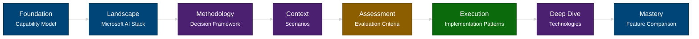

# Microsoft AI Decision Framework

Master the art of selecting the right Microsoft AI technology for your business needs.
{: .page-subtitle }

[Start Learning]({{ '/docs/capability-model' | relative_url }}){: .btn .btn-primary .fs-5 .mb-4 .mb-md-0 .mr-2 }
[Explore Visual Framework Reference]({{ '/docs/visual-framework' | relative_url }}){: .btn .fs-5 .mb-4 .mb-md-0 }

---

## The Challenge

**The pilot rarely fails. The second quarter does.**

Picture the meeting. The demo landed. Executives are happy. Then someone in the back asks the question nobody prepped for: *"So can this thing actually update the customer record, or does it just draft an email about it?"* The room goes quiet, because the honest answer is that the thing was built on a surface that was never designed to carry that permission. Finding out costs a re-platform, a quarter, and a chunk of credibility.

That is the failure mode this guide is built to prevent. The problem is rarely a *bad* technology, since Microsoft doesn't ship many of those. It is choosing a genuinely good technology and handing it more authority than the problem ever needed, then only discovering it after the budget is committed.

The hard part was never "which product?" It's the messy middle: where the data may live, who the agent is when it acts, how far it's allowed to reach, which channels it must show up in, who's accountable when it's wrong, and what happens on the Tuesday it does something surprising. Those questions don't fit on a one-page decision tree, and the checklists that try miss exactly the enterprise edge cases that decide whether a pilot becomes a platform.

Microsoft's portfolio is broad and moving weekly: Microsoft 365 Copilot, Copilot Studio, Microsoft Foundry, Agent Service, Agent Framework, Foundry IQ, Work IQ, GitHub Copilot, and more. Every one of them is the right answer to *some* question. Your job is to know which question you're holding. And because the portfolio moves, "which product?" has quietly been replaced by three sharper questions: **what lifecycle stage is it in, what migration deadline is attached to it, and what governance path does it unlock?**

**This guide exists to prevent false starts.** It gives you a repeatable way of thinking (outcomes, then behaviors, then platforms) so you can pick a tool that fits, defend the trade-off in a design review, and adapt when Microsoft renames half of it next quarter.

---

## Which Conversation Are You In? The 3 AI Buckets

**Three people say "we need AI" and mean three completely different things.**

It's the same problem as three people saying "I need a lawyer." One wants a will. One wants a merger closed. One wants bail by Friday. Same word, three different professionals, three different price tags. Send the wrong one and the meeting is polite and useless.

"AI" is that word now. So before you evaluate a single technology, name the bucket you're actually in. The bucket sets the governance model, the budget line, the skills you need, and the advice that will help you.

| The bucket | Who's asking, and what's actually hurting | What "done" looks like |
| :--- | :--- | :--- |
| **AI for You** | *An employee.* Their day is buried in meetings they didn't attend, threads they can't catch up on, and documents nobody has time to read. They aren't building anything; they're drowning. | People get their afternoons back, inside tools they already have, under controls IT already understands. |
| **AI as a Product or Feature** | *A product owner or architect.* The thing your organization sells, or the process it runs, needs to get smarter, and *you* are accountable when it answers a customer wrongly at 2 a.m. | AI ships as part of what you deliver: grounded answers, agents that act, workflows that hold up under audit. |
| **AI for Your Codebase** | *An engineering leader.* Delivery is the bottleneck. Reviews queue, tests rot, modernization backlogs grow, and hiring won't close the gap fast enough. | The software delivery loop itself gets faster and safer. The product you ship may contain no AI at all. |

Pick wrong and you import the wrong assumptions with it: a productivity licensing conversation bolted onto an architecture problem, or a platform build kicked off when a setting in an admin portal would have done it. Most stalled programs are a bucket error wearing an architecture costume.

[**Walk the full model, including "The AI Podcast Problem" and where each bucket's journey goes next**]({{ '/docs/capability-model#the-3-ai-buckets' | relative_url }}){: .btn .btn-outline .fs-4 .mb-4 .mb-md-0 }

---

## The Four Doors: Why Anyone Would Fund This

**Before you argue about architecture, win the argument about value.**

A business only has four doors that AI can meaningfully walk through. **We call them The Four Doors;** Microsoft's Cloud Adoption Framework names the same four as *business-value quadrants*, split by who feels the impact: two point inward at how you run, two point outward at how you grow. The quadrants are Microsoft's; the doorway framing is ours. If your use case can't be pushed cleanly through one of them, it isn't an architecture problem yet. It's a funding problem, and no technology choice will rescue it.

| Door | Impact | The question it answers |
| :--- | :--- | :--- |
| **Reshape business processes** | Internal | Where is work slow, manual, or duplicated in a way that costs us real money? |
| **Enrich employee experiences** | Internal | Where are our people spending their expertise on things that don't need expertise? |
| **Reinvent customer engagement** | Customer | Where does the customer wait, repeat themselves, or give up? |
| **Accelerate innovation** | Customer | What could we offer that we simply couldn't staff or scale before? |

Notice what the doors have in common: not one of them names a product. That's the point. Outcome first, use case second, technology last. The bucket tells you *which conversation* you're in; the door tells you *whether the conversation deserves a budget*. You need both answers before anyone opens a portal. ([CAF: AI agent business strategy](https://learn.microsoft.com/en-us/azure/cloud-adoption-framework/ai-agents/business-strategy-plan))

The same framework is refreshingly blunt about when the answer is *no agent at all*: a structured, predictable task belongs in regular code or non-generative AI, and static knowledge retrieval belongs in classic RAG. The cheapest AI decision you will ever make is the one where you decide you don't need it.

---

## Six Things This Will Tell You That Nobody Else Will

Most technology guides describe what products do. Microsoft's own docs already do that better than we could. This framework exists for the things that are true, consequential, and written down nowhere convenient:

- **Microsoft ships seven concurrent agent taxonomies, and none of them cross-references another.** An architect reading three official pages can come away with three mental models and no way to tell whether they conflict. [Why that gap is the whole point of this framework](#how-this-relates-to-microsofts-own-frameworks)
- **The custom model your data science team is scoping this quarter probably already ships.** Alert scoring, anomaly detection, forecasting over your own security data, no code required. The most expensive builds in the enterprise are the ones nobody checked for first. [Check before you build]({{ '/docs/scenarios#scenario-5-security-operations-triage' | relative_url }})
- **Multi-agent orchestration is, for most enterprise problems, an answer to a question nobody asked.** It demos beautifully and debugs miserably. The justification for splitting agents is organizational, never technical. [The argument in full]({{ '/docs/scenarios#a-warning-about-multi-agent-orchestration' | relative_url }})
- **Your agent probably carries a named human's permissions, and having its own identity does not change that.** Attribution and data access are separate problems, and most teams fix one and assume they fixed both. [Where this bites]({{ '/docs/scenarios#scenario-10-agent-governance-and-agent-sprawl' | relative_url }})
- **Agentic code scanning asks you to switch off your own prompt-injection defenses.** That is documented, deliberate, and defensible. It is also a trade nobody mentions in the demo. [What you are accepting]({{ '/docs/scenarios#scenario-5-security-operations-triage' | relative_url }})
- **The cheapest AI decision you will ever make is deciding you don't need AI.** A structured, predictable task belongs in ordinary code. Static retrieval belongs in classic search. Knowing when to walk away is the skill this framework is really teaching. [Start at the checkpoint]({{ '/docs/capability-model' | relative_url }})

If any of those made you want to argue, good. That is the reaction this is built for.

---

## Where This Sits, and Who It's For

Choosing a technology is one decision inside a longer loop. Microsoft's Cloud Adoption Framework names six stops on it: **Strategy, Plan, Ready, Govern, Secure, Manage.** Think of running a restaurant rather than catering one dinner. Strategy is deciding what kind of restaurant you are; Plan is the menu and the hiring; Ready is building the kitchen; Govern and Secure are the health code and the locks; Manage is the nightly service that never stops.

**This guide lives mostly in Strategy and Plan.** Keep the other four in view, because the goal is picking a tool you can actually run. ([CAF: AI adoption](https://learn.microsoft.com/en-us/azure/cloud-adoption-framework/ai/))

It's written for people who have to defend a choice: **architects, technical decision makers, engineering teams, and the makers and fusion teams who build alongside them.** What they share is not a job title. It's needing a reusable way to reason rather than a one-page answer, and knowing they'll be asked to explain the trade-off to someone who wasn't in the room.

---

## Your Learning Journey

Follow this progressive path for the best learning experience:

### Core path

```mermaid
%%{init: {'theme':'dark'}}%%
flowchart LR
    F["Foundation<br><small>Capability Model</small>"]
    L["Landscape<br><small>Microsoft AI Stack</small>"]
    M["Methodology<br><small>Decision Framework</small>"]
    C["Context<br><small>Scenarios</small>"]
    A["Assessment<br><small>Evaluation Criteria</small>"]
    E["Execution<br><small>Implementation Patterns</small>"]
    D["Deep Dive<br><small>Technologies</small>"]
    MS["Mastery<br><small>Feature Comparison</small>"]

    F --> L --> M --> C --> A --> E --> D --> MS

    click F "{{ site.baseurl }}/docs/capability-model" "Open Capability Model" _self
    click L "{{ site.baseurl }}/docs/ai-stack" "Open Microsoft AI Stack" _self
    click M "{{ site.baseurl }}/docs/decision-framework" "Open Decision Framework" _self
    click C "{{ site.baseurl }}/docs/scenarios" "Open Scenarios" _self
    click A "{{ site.baseurl }}/docs/evaluation-criteria" "Open Evaluation Criteria" _self
    click E "{{ site.baseurl }}/docs/implementation-patterns" "Open Implementation Patterns" _self
    click D "{{ site.baseurl }}/docs/technologies" "Open Technologies" _self
    click MS "{{ site.baseurl }}/docs/feature-comparison" "Open Feature Comparison" _self

    style F fill:#004578,stroke:#002f4a,color:#fff
    style L fill:#004578,stroke:#002f4a,color:#fff
    style M fill:#4b2070,stroke:#33154c,color:#fff
    style C fill:#4b2070,stroke:#33154c,color:#fff
    style A fill:#8c5e00,stroke:#6a4700,color:#fff
    style E fill:#0b6a0b,stroke:#084c08,color:#fff
    style D fill:#4b2070,stroke:#33154c,color:#fff
    style MS fill:#004578,stroke:#002f4a,color:#fff
```

{: .fs-4 .fw-300 }

### The Progressive Path

| Step | Module | What You'll Learn | Time Investment |
|------|--------|-------------------|-----------------|
| 1) | [Capability Model]({{ site.baseurl }}/docs/capability-model) | **Foundation** - Name the conversation you're in, verify you need an agent at all, and learn to describe behavior before naming a product | 15 min |
| 2) | [Microsoft AI Stack]({{ site.baseurl }}/docs/ai-stack) | **Landscape** - Climb the buy-before-build ladder, find your capability grouping, and see the five planes every solution stands on | 35 min |
| 3) | [Decision Framework]({{ site.baseurl }}/docs/decision-framework) | **Methodology** - Intake gates and nine critical questions to stay simple before scaling | 40 min |
| 4) | [Scenarios]({{ site.baseurl }}/docs/scenarios) | **Context** - Ten patterns of demand with recommended stacks, honest alternatives, and the failure mode for each | 45 min |
| 5) | [Evaluation Criteria]({{ site.baseurl }}/docs/evaluation-criteria) | **Assessment** - Score complexity, skills, budget, governance, and action safety/time-to-production | 15 min |
| 6) | [Implementation Patterns]({{ site.baseurl }}/docs/implementation-patterns) | **Execution** - Repeatable patterns (Studio-to-Azure, multi-agent, grounding) with pivot signals | 30 min |
| 7) | [Technologies]({{ site.baseurl }}/docs/technologies) | **Deep Dive** - Detailed specs, data boundaries, and status for Microsoft AI platforms/services | 60 min |
| 8) | [Feature Comparison]({{ site.baseurl }}/docs/feature-comparison) | **Mastery** - Side-by-side matrices to justify trade-offs across orchestration, data, and workflows | 15 min |

{: .note }
> **On the times.** These are measured, not aspirational: prose at 250 words per minute, reference tables at half that because you scan them rather than read them. Steps 7 and 8 are reference material and behave like it. Nobody reads the Technologies page end to end, and it isn't built to be read that way. Look up what you need and leave.

**Supplemental references (use as needed):** [Visual Framework]({{ site.baseurl }}/docs/visual-framework) | [Quick Reference]({{ site.baseurl }}/docs/quick-reference) | [Resources]({{ site.baseurl }}/docs/resources) | [Glossary]({{ site.baseurl }}/docs/glossary) | [AI Instinct]({{ site.baseurl }}/docs/ai-instinct) | [Agentic Engineering]({{ site.baseurl }}/docs/agentic-engineering)

**You do not have to read it in order.** If you already know what you're building, jump to [Scenarios]({{ site.baseurl }}/docs/scenarios) and work backward. If you're facilitating a workshop, start with the [Visual Framework]({{ site.baseurl }}/docs/visual-framework) diagrams. If you just need an answer today, the shortcuts are below. The path exists so the framework compounds, not because the order is sacred.

---

## Common Paths (Quick Shortcuts)

**You have already decided what you're building and you want a starting point.** These lead with products deliberately, because you've earned it. Everyone else should use the path above.

| What you said | Where to start |
| :--- | :--- |
| *"I need something in production next week"* | **[M365 Copilot]({{ '/docs/technologies#microsoft-365-copilot' | relative_url }})** once IT completes [tenant readiness](https://learn.microsoft.com/en-us/microsoft-365/copilot/microsoft-365-copilot-setup), or **[Copilot Studio]({{ '/docs/technologies#copilot-studio' | relative_url }})** from a template |
| *"I have makers but no developers"* | **[Copilot Studio]({{ '/docs/technologies#copilot-studio' | relative_url }})** plus **[AI Builder]({{ '/docs/ai-stack#ai-services-and-building-blocks' | relative_url }})** |
| *"I have a dev team and complex requirements"* | **[Microsoft Foundry]({{ '/docs/technologies#microsoft-foundry-azure' | relative_url }})** or the **[M365 Agents SDK]({{ '/docs/technologies#microsoft-365-agents-sdk--toolkit' | relative_url }})** |
| *"I need enterprise integration plus AI"* | **[Azure Logic Apps](https://learn.microsoft.com/en-us/azure/logic-apps/agent-workflows-concepts)**, 1,400+ connectors plus agentic workflows. Status varies by hosting model; check before you commit |
| *"I need to extend M365 Copilot"* | **[Graph Connectors]({{ '/docs/ai-stack#extensibility-into-existing-copilots' | relative_url }})** for data, **[Declarative Agents]({{ '/docs/ai-stack#extensibility-into-existing-copilots' | relative_url }})** for custom skills |
| *"I need an intranet copilot with citations"* | **[Grounded Q&A]({{ '/docs/scenarios#scenario-1-grounded-qa-over-enterprise-content' | relative_url }})**. Settle the trust boundary before you pick a store. If content lives in M365 and the audience is employees, permission trimming is inherited rather than implemented |
| *"I need answers from PDFs with tables and diagrams"* | **[Grounded Q&A]({{ '/docs/scenarios#scenario-1-grounded-qa-over-enterprise-content' | relative_url }})**. Layout-aware extraction is a retrieval-quality problem, not an agent problem. Fix the chunking before you add tools |
| *"I need multi-agent orchestration without writing a graph"* | Match the role before the tool: **[Logic Apps agentic workflows](https://learn.microsoft.com/en-us/azure/logic-apps/agent-workflows-concepts)** for visual business processes, **[Agent Framework]({{ '/docs/technologies#microsoft-agent-framework' | relative_url }})** for code-first orchestration, **A2A** for lightweight delegation. Read [the warning]({{ '/docs/scenarios#a-warning-about-multi-agent-orchestration' | relative_url }}) first |
| *"I need to speed up the software delivery loop itself"* | Start in the IDE, then delegate: the **[GitHub Copilot cloud agent](https://docs.github.com/en/copilot/concepts/agents/cloud-agent/about-cloud-agent)** for async work on an issue, **custom agents** to codify how your team works, and the **[GitHub Copilot SDK](https://docs.github.com/en/copilot)** when you need that harness in your own application |
| *"I need my agent grounded in our actual data"* | Match the store to the shape of the question: **[Azure AI Search]({{ '/docs/technologies#azure-ai-search' | relative_url }})** for enterprise retrieval with ACL trimming, **PostgreSQL** with pgvector when vectors belong beside relational data, **Cosmos DB** for global-scale operational data, **Fabric / OneLake** when the grounding set is analytical and already curated |
| *"I need to evaluate a Foundry agent in Teams or M365"* | **[The Foundry to M365 publish path]({{ '/docs/implementation-patterns#pattern-9-foundry-agent--m365-copilot-publish-path' | relative_url }})**. Keep the current endpoint as your baseline and test every tool, identity, and channel path. Do not assume parity |
| *"I need a governed M365 copilot with better SharePoint answers"* | **[Grounded Q&A]({{ '/docs/scenarios#scenario-1-grounded-qa-over-enterprise-content' | relative_url }})** for the retrieval half, **[Agent governance]({{ '/docs/scenarios#scenario-10-agent-governance-and-agent-sprawl' | relative_url }})** for the identity and ownership half |
| *"I need hybrid OneDrive search for a custom engine agent"* | **[Copilot Search API]({{ '/docs/quick-reference#technology-by-user-experience' | relative_url }})**, Graph hybrid semantic and lexical search with M365 security trimming |

{: .warning }
> **Two seams worth knowing before you commit.** **Foundry Workflows is retiring** on the date in the calendar below, so do not start new solutions on it; move code-first graphs to **Microsoft Agent Framework**, visual processes to **Logic Apps**, lightweight handoffs to **A2A**. And Foundry Agent Service lists the GitHub Copilot SDK as a supported framework, but **Foundry Hosted agents support Python and C# only**, so a Go, Java, or Rust Copilot SDK agent is not directly hostable there.

{: .note }
> These are starting points, not a substitute for the framework. Every one of them has a trade-off attached that the [progressive path](#your-learning-journey) makes visible.

---

## The Migration Calendar

**Nothing moves an architecture review like a date.**

You can debate elegance for a quarter. You cannot debate a retirement notice. Deadlines are the one input in this whole framework that doesn't care about your opinion, which makes them the most useful forcing function you have. Treat this like a shot clock taped to the wall of the design review: it doesn't tell you what to build, it tells you how long you get to keep pretending the decision isn't urgent.

Check it before you commit to a surface, and again before you renew a budget.

| Date | What happens | Where it lands |
| :--- | :--- | :--- |
| **2025-11-10** *(passed)* | GitHub **App-based Copilot Extensions** deprecated. Client-side VS Code Copilot Extensions remain fully supported. | Migrate App-based extensions to **MCP servers** |
| **June 2026** *(passed)* | **[Copilot Studio for Teams](https://learn.microsoft.com/en-us/microsoft-copilot-studio/fundamentals-get-started-teams)** can no longer create classic chatbots; the app redirects to the Copilot Studio web app. Scope: **makers on a Teams plan**, who are limited to classic orchestration and can only publish to Microsoft Teams. A standalone Copilot Studio subscription is unaffected. | Build in the **Copilot Studio web app** |
| **2026-09-01** | **GitHub AI-credit promotional allowances end.** Business 3,000 → 1,900/user/month; Enterprise 7,000 → 3,900/user/month. | Re-baseline the developer AI budget *before* the reset, not after |
| **2026-12-01** | **Microsoft Foundry Workflows retires.** Visual designer and in-portal execution unsupported after this date. | **Microsoft Agent Framework** (recommended) · **Azure Logic Apps** (visual designer) · **A2A** (lightweight handoffs) |
| **2027-03-31** | **Azure Cache for Redis Enterprise and Enterprise Flash** retire (instances disabled 2027-04-01). The nearest infrastructure deadline under most agent memory and semantic-cache designs. | **Azure Managed Redis** (GA, Entra-native) |
| **2028-09-30** | **Azure Cache for Redis Basic, Standard, and Premium** retire (instances disabled 2028-10-01). | **Azure Managed Redis** |

{: .warning }
> **Read this as a trigger list, not a to-do list.** A date only matters if you're standing on the thing that expires. Two of these, the Redis retirements, will quietly reach into agent memory, session state, and semantic caching in architectures that never mention Redis in the design doc. Go look.

Undated but directionally certain: Semantic Kernel and AutoGen both point forward to **Microsoft Agent Framework**, which Microsoft calls the *"direct successor"* and *"next generation of both."* **No sunset date has been announced for either.** Migration guides exist. Plan the move; don't panic about it.

---

## How This Relates to Microsoft's Own Frameworks

**We are not competing with Microsoft's guidance. We're the connective tissue between the pieces of it.**

Microsoft publishes a great deal of high-quality agent guidance, and it publishes it in parallel, from different teams, with different vocabularies. Our research counted **seven concurrent agent taxonomies (six documented on Microsoft Learn, one blog-only), none of which supersedes, reconciles, or even cross-references another.** That isn't a criticism; it's what shipping fast looks like from the inside. But it means an architect reading three official pages can come away with three different mental models and no way to tell whether they conflict.

That gap is our job. Microsoft's docs answer *"what does this product do?"* extremely well. This framework answers *"which of these am I actually in, and what will I regret in six months?"* Read theirs for authority. Read ours for judgment. Then go build.

| Microsoft's guidance | What it's best at | Where we pick it up |
| :--- | :--- | :--- |
| [Agents hub](https://learn.microsoft.com/en-us/agents/): Plan → Design → Adopt → Improve | The deepest agent-specific catalog Microsoft has: agent archetypes, an agentic maturity model, adoption patterns, and Center of Excellence guidance | Read it for depth on any single agent concept; we point at it rather than duplicate it |
| [CAF: AI adoption](https://learn.microsoft.com/en-us/azure/cloud-adoption-framework/ai/) | The six-stage organizational loop: Strategy → Plan → Ready → Govern → Secure → Manage | "Where This Sits," above |
| [CAF: AI agents](https://learn.microsoft.com/en-us/azure/cloud-adoption-framework/ai-agents/) | Plan → Govern & secure → Build → Manage, plus use-case scoring and business-value quadrants | "The Four Doors," above; the scoring gates in the Decision Framework |
| [Well-Architected Framework: AI workloads](https://learn.microsoft.com/en-us/azure/well-architected/ai/) | Design areas for AI workloads once you've chosen. Note there is **no separate WAF service guide for agents**; CAF routes agent teams here | Evaluation Criteria and Implementation Patterns |
| [BXT / Business Envisioning](https://learn.microsoft.com/en-us/microsoft-cloud/dev/copilot/isv/business-envisioning) and [Capability Envisioning](https://learn.microsoft.com/en-us/microsoft-cloud/dev/copilot/isv/capability-envisioning) | Deciding whether an idea deserves to exist at all: Shelve, Research, Incubate, Accelerate to MVP | Phase 1 gate in the Decision Framework. *(Both pages are ISV-scoped and 18 to 22 months old; the methodology holds, the product references don't.)* |
| [Azure Architecture Center](https://learn.microsoft.com/en-us/azure/architecture/ai-ml/architecture/baseline-microsoft-foundry-chat) | Reference architectures and the complexity spectrum: direct model call → single agent with tools → multi-agent orchestration | Implementation Patterns |

---

## Bonus: AI Instinct, the Human Side of AI Adoption

This framework teaches you how to *choose* AI technologies. But technology choices are only half the equation. The other half is how people actually *partner* with AI once you've made the choice.

[**AI Instinct**]({{ site.baseurl }}/docs/ai-instinct) is a companion framework written for everyone, not just architects or developers. Whether you're a nurse, a mechanic, a teacher, a parent, or a CEO, AI partnership is becoming as fundamental as reading and writing. AI Instinct names the four behavioral instincts (Spine, Voice, Gravity, Rhythm) that separate people who use AI occasionally from people who've made it part of how they think.

This isn't a technical guide. It's the human foundation that makes every technical decision in this framework land. Share it with your team, your stakeholders, or anyone asking "why should I care about AI?"

[Read AI Instinct]({{ site.baseurl }}/docs/ai-instinct){: .btn .fs-5 .mb-4 .mb-md-0 .mr-2 } [Download PDF]({{ '/assets/AI_Instinct.pdf' | relative_url }}){: .btn .btn-outline .fs-5 .mb-4 .mb-md-0 }

---

## Framework Principles

1. **Source-first.** Every technical claim is checked against official Microsoft documentation, and status is stated only where the source states it.
2. **Outcome before product.** Business value, then the use case, then the concept, then the technology. Always in that order.
3. **Governance-aware.** Identity comes before controls. An agent needs something to *be* before you decide what it may *do*, and the application layer stays yours to own regardless of what the platform gives you.
4. **Pattern-oriented.** Approaches drawn from real deployments, with the pivot signals that tell you when to change course.
5. **Start simple, scale smart.** Choose the least powerful thing that meets the requirement. Most regret in this field comes from over-reach, not under-reach.
6. **Honest about the frontier.** Where something is contested or still moving, we say so rather than manufacture a verdict.

**Currency:** this reflects the state as of **July 2026**. Microsoft's AI portfolio moves weekly, so verify against official sources before a production decision. Where a claim is likely to age badly, we have tried to write the durable version of it.

---

## Prefer Microsoft's Simplified Version?

If you'd rather start from Microsoft's own high-level decision tree, these are the two most useful diagrams. Read them first if you like, then come back for the parts they leave out.

*CAF criteria to rank agent use cases by impact, feasibility, and desirability (Microsoft Learn, accessed 2025-12-09).* [(Reference)](https://learn.microsoft.com/en-us/azure/cloud-adoption-framework/ai-agents/business-strategy-plan)

*CAF technology plan decision tree for choosing SaaS vs custom agents (Microsoft Learn, accessed 2025-12-09).* [(Reference)](https://learn.microsoft.com/en-us/azure/cloud-adoption-framework/ai-agents/technology-solutions-plan-strategy)

{: .warning }
> **What a simplified tree cannot tell you.** It will not surface governance requirements, data boundaries, network isolation, permission models, action safety, cost at scale, or what happens the Tuesday your agent does something surprising. Those are exactly the questions that decide whether a pilot becomes a platform, and they are why the rest of this framework exists.

---

## Credits & Foundations

This framework builds on:

- [CAF: AI agent adoption](https://learn.microsoft.com/en-us/azure/cloud-adoption-framework/ai-agents/) (plan, govern and secure, build, manage)
- [CAF: AI strategy](https://learn.microsoft.com/en-us/azure/cloud-adoption-framework/ai/strategy)
- [Microsoft Agents hub](https://learn.microsoft.com/en-us/agents/) (Plan, Design, Adopt, Improve)
- [M365 Copilot extensibility guidance](https://learn.microsoft.com/en-us/microsoft-365/copilot/extensibility/agents-overview)
- Microsoft's earlier [Business Envisioning / BXT](https://learn.microsoft.com/en-us/microsoft-cloud/dev/copilot/isv/business-envisioning) guidance, for the intake scorecard

---

**Ready?** [Start with the Capability Model]({{ '/docs/capability-model' | relative_url }}) and find out which conversation you're actually in.
