# Microsoft AI Decision Framework
{: .fs-9 }

Master the art of selecting the right Microsoft AI technology for your business needs.
{: .fs-6 .fw-300 }

[Start Learning]({{ '/docs/decision-framework' | relative_url }}){: .btn .btn-primary .fs-5 .mb-4 .mb-md-0 .mr-2 }
[Explore Visual Framework Reference]({{ '/docs/visual-framework' | relative_url }}){: .btn .fs-5 .mb-4 .mb-md-0 }

---

## The Challenge

Microsoft's AI portfolio includes **M365 Copilot, Copilot Studio, Azure AI Foundry, Agent Service, SDKs, and more**. Each technology serves different needs, and choosing the wrong one wastes time and money.

Enterprise AI decisions also have countless edge cases—data boundaries, orchestration models, compliance controls, channel requirements—so a single static decision tree oversimplifies reality. This guide is intentionally **Level 300-400** material: it teaches you how to think, model tradeoffs, and construct your own decision trees for any use case instead of memorizing ours.

**This guide solves that problem** by teaching you a systematic framework (BXT + capability model + evaluation criteria) for evaluating and selecting the right tool for your specific requirements, then adapting the framework as Microsoft ships new capabilities.

---

## What You'll Learn

By following this framework, you'll gain:

✅ **Methodology** - The BXT decision framework for systematic technology selection  
✅ **Foundation** - Understanding of Microsoft's five-layer AI capability model  
✅ **Context** - Real-world scenarios showing how others solved similar problems  
✅ **Application** - Interactive decision trees for visual technology selection  
✅ **Assessment** - Evaluation criteria for complexity, skills, budget, and governance  
✅ **Execution** - Implementation patterns and architecture guidance  
✅ **Mastery** - Deep technical knowledge of each technology's capabilities  

---

## Who This Framework Serves

This content assumes readers can reason across business, experience, and technology concerns and want a reusable evaluation pattern rather than a shortcut. Expect to synthesize enterprise constraints, justify architecture choices, and extend the framework to new Microsoft releases.

- **Technical decision makers & strategists** – AI program sponsors, product owners, security/compliance leads, and other executives accountable for cross-functional alignment and governance.
- **Architects (AI, application, integration)** – AI solution architects, application/platform architects, and integration leads who design landing zones, data boundaries, and orchestration models.
- **Pro-code engineering teams** – Software engineers, data engineers, ML engineers, and agent developers responsible for building, instrumenting, and operating custom copilots or services.
- **Makers & fusion teams** – Product managers, subject-matter experts, Power Platform makers, IT admins, and frontline innovators who partner with engineering to deliver governed AI outcomes.

If you match these personas, this framework will help you design your own decision flows, facilitate architecture reviews, and explain rationale to stakeholders.

## Your Learning Journey

Follow this progressive path for the best learning experience:

```mermaid
%%{init: {'theme':'dark', 'themeVariables': {'fontSize':'14px'}}}%%
flowchart LR
    Start([📖 Start]) --> DF[1️⃣ Decision Framework<br/>BXT Method]
    DF --> CM[2️⃣ Capability Model<br/>Five Layers]
    CM --> EC[3️⃣ Evaluation Criteria<br/>Readiness]
    EC --> SC[4️⃣ Scenarios<br/>Examples]
    SC --> IP[5️⃣ Implementation<br/>Patterns]
    IP --> TECH[6️⃣ Technologies<br/>Deep Dive]
    TECH --> FC[7️⃣ Comparison<br/>Features]

    DF -. Reference .-> VF[Visual Framework<br/>Diagrams]
    SC -. Reference .-> VF

    style Start fill:#4CAF50,stroke:#2E7D32,color:#fff
    style DF fill:#1976D2,stroke:#0D47A1,color:#fff
    style CM fill:#1976D2,stroke:#0D47A1,color:#fff
    style EC fill:#1976D2,stroke:#0D47A1,color:#fff
    style SC fill:#1976D2,stroke:#0D47A1,color:#fff
    style IP fill:#1976D2,stroke:#0D47A1,color:#fff
    style TECH fill:#1976D2,stroke:#0D47A1,color:#fff
    style FC fill:#1976D2,stroke:#0D47A1,color:#fff
    style VF fill:#1976D2,stroke:#0D47A1,color:#fff
```

### The Progressive Path

| Step | Module | What You'll Learn | Time Investment |
|------|--------|-------------------|-----------------|
| 1️⃣ | [Decision Framework]({{ '/docs/decision-framework' | relative_url }}) | **Methodology** - BXT assessment + nine critical questions | 20 min |
| 2️⃣ | [Capability Model]({{ '/docs/capability-model' | relative_url }}) | **Foundation** - Five layers from M365 Copilot to infrastructure | 15 min |
| 3️⃣ | [Evaluation Criteria]({{ '/docs/evaluation-criteria' | relative_url }}) | **Assessment** - Complexity, skills, budget, governance | 15 min |
| 4️⃣ | [Scenarios]({{ '/docs/scenarios' | relative_url }}) | **Context** - Real-world use cases with solutions | 15 min |
| 5️⃣ | [Implementation Patterns]({{ '/docs/implementation-patterns' | relative_url }}) | **Execution** - Proven architecture patterns | 15 min |
| 6️⃣ | [Technologies]({{ '/docs/technologies' | relative_url }}) | **Deep Dive** - Technical specifications for each tool | 30 min |
| 7️⃣ | [Feature Comparison]({{ '/docs/feature-comparison' | relative_url }}) | **Mastery** - Side-by-side feature matrices | 10 min |

**Total learning time:** ~2.5 hours for complete framework mastery

**Reference materials** (use as needed): [Visual Framework]({{ '/docs/visual-framework' | relative_url }}) · [Quick Reference]({{ '/docs/quick-reference' | relative_url }}) · [Resources]({{ '/docs/resources' | relative_url }}) · [Glossary]({{ '/docs/glossary' | relative_url }})

### Visual Framework Reference

Use the [Visual Framework]({{ '/docs/visual-framework' | relative_url }}) diagrams when you need to facilitate workshops, recap the nine questions, or socialize the architecture. The visuals reinforce the methodology—they're not a shortcut around the foundational content.

---

## Choose Your Learning Path

### 🎓 First-Time Learner
**Recommended:** Follow the sequential path above for comprehensive understanding.

**Start here:** [Decision Framework]({{ '/docs/decision-framework' | relative_url }}) - Learn the methodology and critical questions

### 🎨 Visual Learner
**Prefer diagrams?** Skim the decision trees to orient yourself, then follow the full path for depth.

**Reference:** [Visual Framework]({{ '/docs/visual-framework' | relative_url }}) - Use alongside the Decision Framework and Evaluation Criteria

### ⚡ Need Quick Answers
**Experienced user?** Use the fast-lookup tables and scenario shortcuts.

**Start here:** [Scenarios]({{ '/docs/scenarios' | relative_url }}) - "I need X" → recommended path

---

---

## Common Paths (Quick Shortcuts)

For experienced users who need fast recommendations:

### "I need something in production next week"

→ **[M365 Copilot]({{ '/docs/technologies#microsoft-365-copilot' | relative_url }})** (fastest end-user experience once IT completes [tenant readiness and licensing](https://learn.microsoft.com/en-us/copilot/microsoft-365/microsoft-365-copilot-setup)) or **[Copilot Studio]({{ '/docs/technologies#copilot-studio' | relative_url }})** (templates available)

### "I have makers but no developers"

→ **[Copilot Studio]({{ '/docs/technologies#copilot-studio' | relative_url }})** + **[AI Builder]({{ '/docs/capability-model#layer-4-infrastructure--ai-services-building-blocks' | relative_url }})**

### "I have a dev team and complex requirements"

→ **[Azure AI Foundry]({{ '/docs/technologies#azure-ai-foundry' | relative_url }})** or **[M365 Agents SDK]({{ '/docs/technologies#microsoft-365-agents-sdk--toolkit' | relative_url }})**

### "I need enterprise integration + AI"

→ **[Azure Logic Apps]({{ '/docs/technologies#azure-logic-apps' | relative_url }})** (1,400+ connectors, AI agent workflows)

### "I need to extend M365 Copilot"

→ **[Graph Connectors]({{ '/docs/capability-model#layer-2-extensibility-enhance-existing-copilots' | relative_url }})** (data) or **[Declarative Agents]({{ '/docs/capability-model#layer-2-extensibility-enhance-existing-copilots' | relative_url }})** (custom skills)

{: .note }
> **Note:** These shortcuts skip the learning framework. For comprehensive understanding, follow the [progressive learning path](#your-learning-journey) above.

---

## Framework Principles

This guide is built on evidence-based research and systematic decision-making:

1. **Source-First Research** - All content backed by official Microsoft documentation
2. **Framework-Driven** - BXT methodology + 6 critical questions + scenario criteria
3. **Pattern-Oriented** - Proven implementation approaches from real deployments
4. **Progressive Learning** - Foundation → Context → Application → Mastery
5. **Start Simple, Scale Smart** - Choose the simplest technology that meets requirements

---

## How to Use This Guide

**Sequential Learning (Recommended for first-time users)**  
Follow the numbered path from Capability Model → Feature Comparison to build comprehensive knowledge.

**Modular Learning (For specific questions)**  
Jump directly to relevant sections using the navigation sidebar or Quick Reference.

**Visual Learning (For diagram-oriented thinkers)**  
Start with the Visual Framework to see decision trees, then drill into details as needed.

**Scenario-Based Learning (For practical problem-solvers)**  
Begin with Scenarios to find use cases similar to yours, then explore referenced sections.

---

## About This Framework

**Purpose:** Systematic methodology for navigating Microsoft's AI portfolio and selecting the right technology for your business requirements.

**Approach:**

- Source-backed (official Microsoft Learn documentation)
- Framework-driven (BXT + Technology Groupings + Selection Criteria)
- Pattern-oriented (proven architecture approaches)
- Validation-focused (all diagrams validated against official capabilities)

**Maintenance:** This guide reflects the state as of **November 2025**. Microsoft's AI capabilities evolve rapidly—always verify with official sources for production decisions.

---

## Still Want the Simplified Version?

After understanding the comprehensive framework above, if you prefer Microsoft's official high-level decision tree:

**Source:** [Azure Cloud Adoption Framework - AI Strategy](https://learn.microsoft.com/en-us/azure/cloud-adoption-framework/scenarios/ai/strategy)

{: .warning }
> **Why we recommend the full framework:** This simplified tree doesn't address critical enterprise considerations like governance requirements, data boundaries, network isolation, permissions models, action safety, scale/cost tradeoffs, and proactive capabilities. Real-world decisions require the systematic approach taught in this guide.

---

## Credits & Foundations

This framework integrates:

- Microsoft's [Business-Experience-Technology (BXT) Framework](https://learn.microsoft.com/en-us/microsoft-cloud/dev/copilot/isv/business-envisioning)
- [Cloud Adoption Framework AI Strategy](https://learn.microsoft.com/en-us/azure/cloud-adoption-framework/scenarios/ai/strategy)
- [M365 Copilot Extensibility Guidance](https://learn.microsoft.com/en-us/microsoft-365-copilot/extensibility/agents-overview)

---

**Ready to start your learning journey?** → [Begin with the Decision Framework]({{ '/docs/decision-framework' | relative_url }})
