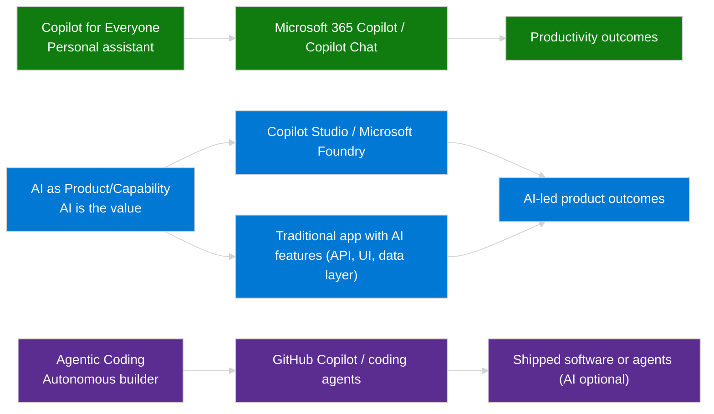

# Five Capability Model
{: .no_toc }

Microsoft's five capability model provides a practical map for choosing the right starting point in the Microsoft AI portfolio. The model reflects Microsoft's "adopt → extend → build" guidance for Copilot experiences, the Copilot stack training, and ISV Copilot stack architectures, grounded in Azure AI workload design principles that emphasize clear boundaries across intelligent systems. See [Adopt, extend and build Copilot experiences across the Microsoft Cloud](https://learn.microsoft.com/en-us/copilot/roadmap/overview), [Explore the Copilot stack](https://learn.microsoft.com/en-us/training/modules/explore-copilot-stack/), [Creating Generative AI Experiences with the Microsoft Cloud](https://learn.microsoft.com/en-us/microsoft-cloud/dev/copilot/isv/isv-extensibility-story#scenarios-and-approaches), and [Application design for AI workloads](https://learn.microsoft.com/en-us/azure/well-architected/ai/application-design#application-layer-architecture).

The result is five capability groups that act as entry points-not a linear maturity ladder. You can start with ready-to-use Copilots, extend them, or build custom agents on the platform that fits your needs. Azure's AI strategy guidance emphasizes starting with prebuilt Copilots when they meet the scenario, and moving to Copilot Studio, Microsoft Foundry, or full-code builds only when you need deeper customization or control. See [Create your AI strategy](https://learn.microsoft.com/en-us/azure/cloud-adoption-framework/scenarios/ai/strategy#define-an-ai-technology-strategy) and [Technology plan for AI agents](https://learn.microsoft.com/en-us/azure/cloud-adoption-framework/ai-agents/technology-solutions-plan-strategy#build-ai-agents).

**How to use this page:** Pick the capability group that matches your **entry point**, then mix and match as needed. Use **Group 1** for ready-to-use Copilots, **Group 2** for extending Microsoft 365 Copilot, **Group 3** for building custom agents (Copilot Studio or Microsoft Foundry), **Group 4** for shared AI building blocks, and **Group 5** for specialized domain copilots. The goal is to avoid reinventing what already exists and to invest in custom development only when the gap is clear.

## Orientation: Three Capability Buckets

Before the five capability groups, align on the three core capability buckets that describe *how* AI shows up. This keeps early conversations grounded in outcomes (who uses it and how) before you debate platforms.

| Bucket | What It Is | Key Distinction |
|--------|------------|-----------------|
| **Copilot for Everyone** | AI as personal assistant | Helps you do *your* work and life tasks |
| **AI as Product/Capability** | AI is the value delivered to end users | Standalone agents, embedded features, LLM-powered integrations—users consume AI outcomes |
| **Agentic Coding** | Autonomous technical builder | AI builds software or systems; output may or may not contain AI features |

**Insight:**

- **Copilot for Everyone:** AI boosts individual productivity and meets people where they work by clearing routine friction.
- **AI as Product/Capability:** AI *is* the product value users consume; this bucket is about shipping AI features and agents as core product components.
- **Agentic Coding:** AI is the builder (autonomous creation); GitHub Copilot’s coding agent generates and ships code—whether it’s AI-powered features or conventional apps—and behaves like a co-developer, not a helper.

## Table of contents
{: .no_toc .text-delta }

1. TOC
{:toc}

---

## Group 1: Consumption (End-User AI)

Ready-to-use AI experiences for immediate productivity.

| Feature | Description | Documentation |
|---------|-------------|---------------|
| **Microsoft 365 Copilot Chat** | **Included** enterprise-secure chat (m365copilot.com, m365.cloud.microsoft/chat, Teams, Outlook, Edge) with web grounding, Copilot Pages, file uploads, image generation, and optional pay-as-you-go agents under IT control. | [Overview](https://learn.microsoft.com/en-us/copilot/overview#microsoft-365-copilot-chat-copilot-chat) · [Copilot for all announcement](https://www.microsoft.com/en-us/microsoft-365/blog/2025/01/15/copilot-for-all-introducing-microsoft-365-copilot-chat/) |
| **Microsoft 365 Copilot** | Paid add-on that grounds Copilot in Microsoft Graph data and delivers in-app copilots across Microsoft 365. | [Overview](https://learn.microsoft.com/en-us/copilot/microsoft-365/microsoft-365-copilot-overview) |
| **Built-in Agents** | Researcher, Analyst, Visual Creator, Prompt Coach, Idea Coach, Writing Coach | [Docs](https://learn.microsoft.com/en-us/training/modules/explore-prebuilt-microsoft-365-copilot-agents/) |
| **Agent Store** | Discover, acquire, and manage Copilot agents through the in-app Microsoft 365 store (Word and PowerPoint; Excel coming) | [Release notes](https://learn.microsoft.com/en-us/copilot/microsoft-365/release-notes) |
| **Excel Surveys Agent** | Build/analyze surveys inside Excel (Web/Win/Mac) | [Release notes](https://learn.microsoft.com/en-us/copilot/microsoft-365/release-notes) |
| **Custom engine agents in Office apps** | Run custom agents directly inside Word/PowerPoint/Excel clients (engine agents surfaced in desktop apps) | [Release notes](https://learn.microsoft.com/en-us/copilot/microsoft-365/release-notes) |

**When to use:** Start here when the outcome is already solved by Microsoft 365 experiences—deliver productivity fast with Copilot Chat and in-app copilots, then add extensions or custom builds only where a real gap exists.

---

## Group 2: Extensibility (Enhance Existing Copilots)

Extend M365 Copilot with organizational knowledge and actions.

| Extension Type | Description | Documentation |
|----------------|-------------|---------------|
| **Copilot connectors (formerly Microsoft Graph connectors)** | Ingest external content into Microsoft Graph so Copilot and Microsoft Search can discover, summarize, and cite it | [Docs](https://learn.microsoft.com/en-us/microsoft-365-copilot/extensibility/overview-copilot-connector) |
| **Model Context Protocol (MCP)** | Standardized protocol for exposing data and tools to agents; connect remote MCP servers as governed tools for agents | [Docs](https://learn.microsoft.com/en-us/azure/ai-foundry/mcp/build-your-own-mcp-server?view=foundry) |
| **API Plugins** | Enable declarative agents in Microsoft 365 Copilot to interact with REST APIs that have an OpenAPI description | [Docs](https://learn.microsoft.com/en-us/microsoft-365-copilot/extensibility/overview-api-plugins) |
| **Teams Message Extensions** | Extend Copilot with Teams-based actions | [Docs](https://learn.microsoft.com/en-us/microsoftteams/platform/messaging-extensions/what-are-messaging-extensions) |
| **Declarative Agents** | Configure agents with instructions, knowledge sources, and actions for Microsoft 365 Copilot | [Docs](https://learn.microsoft.com/en-us/microsoft-365-copilot/extensibility/build-declarative-agents) |

**When to use:** Choose this grouping when you need to inject enterprise knowledge or governed actions into Microsoft 365 Copilot without building a fully custom agent runtime.

---

## Group 3: Development Platforms (Build Custom Agents)

Platforms for building agents with varying levels of control and complexity.

| Technology | Description | Key Capabilities | Documentation |
|------------|-------------|------------------|---------------|
| **Copilot Studio** | Low-code to pro-code SaaS for custom agents | Managed governance, multi-channel, BYOM/BYOK | [Docs](https://learn.microsoft.com/en-us/microsoft-copilot-studio/) |
| **Power Apps Plan Designer** | AI-assisted solution architecture | Generates Dataverse tables, roles, and app structure from natural language; accelerates Group 3 builds | [Docs](https://learn.microsoft.com/en-us/power-apps/maker/canvas-apps/ai-overview) |
| **Microsoft Agent Framework** | Successor to Semantic Kernel and AutoGen that unifies agent and workflow development (Public Preview) | Multi-agent workflows (sequential, concurrent, handoff, Magentic), thread-based state, MCP and tool integration | [Docs](https://learn.microsoft.com/en-us/agent-framework/overview/agent-framework-overview) |
| **AG-UI Protocol Integration (Preview)** | Standardized protocol to surface Agent Framework experiences in custom web and mobile clients | Seven protocol capabilities (streaming, backend tool rendering, human-in-loop approvals, generative UI, shared/predictive state) with ASP.NET Core and FastAPI adapters; CopilotKit interoperability | [Docs](https://learn.microsoft.com/en-us/agent-framework/integrations/ag-ui/) |
| **M365 Agents SDK** | Full-stack SDK for publishing custom engine agents across Microsoft 365 Copilot, Teams, web, and custom apps | Channel adapters, conversation state, orchestrator-agnostic integrations | [Docs](https://learn.microsoft.com/en-us/microsoft-365/agents-sdk/agents-sdk-overview) |
| **Microsoft Foundry** | Unified development environment for model catalog, prompt flow, evaluations, and agent runtime | Model catalog, prompt flow, evaluations, and agent tooling in a single workspace | [Docs](https://learn.microsoft.com/en-us/azure/ai-foundry/?view=foundry-classic) |
| **Foundry Agent Service** | Managed runtime for building, hosting, and scaling agent experiences | Managed agent runtime with tools, memory, and enterprise controls | [Docs](https://learn.microsoft.com/en-us/azure/ai-foundry/agents/overview?view=foundry-classic) |
| **LangChain Ecosystem (Third-party)** | OSS framework for LLM applications (Python/JS) | **LangChain**: Azure integrations, prompt flow; **LangGraph**: agent workflows, state management; **LangSmith**: tracing & observability | [LangChain Docs](https://learn.microsoft.com/en-us/azure/machine-learning/prompt-flow/how-to-integrate-with-langchain?view=azureml-api-2) \| [LangGraph Docs](https://learn.microsoft.com/en-us/azure/developer/javascript/ai/langchain-agent-on-azure) \| [LangSmith Docs](https://learn.microsoft.com/en-us/azure/ai-foundry/how-to/develop/trace-agents-sdk?view=foundry-classic) |

**When to use:** Choose this group when you need custom logic, orchestration, or channel reach beyond Microsoft 365 extensibility. This is where teams decide between a managed SaaS builder (Copilot Studio), a PaaS build platform (Microsoft Foundry), or full-code SDKs.

---

## Group 4: Infrastructure & AI Services (Building Blocks)

Foundational services that power agents across all platforms.

| Service | Description | Key Capabilities | Documentation |
|---------|-------------|------------------|---------------|
| **Azure OpenAI (Foundry Models)** | Enterprise GPT models with VNet, RBAC, tokens per minute (TPM) quotas | Managed LLM infrastructure | [Docs](https://learn.microsoft.com/en-us/azure/ai-foundry/openai/overview) |
| **Azure AI Search** | Agentic retrieval/knowledge bases with reasoning effort + partial responses, Foundry IQ integration, SharePoint ACL + sensitivity label enforcement | Semantic ranker + agentic retrieval on free tier; knowledge sources (SharePoint/OneLake/web) with content extraction | [Docs](https://learn.microsoft.com/en-us/azure/search/) |
| **Azure API Management (AI Gateway)** | Centralized governance control plane | Token rate limiting, model routing, chargeback, content safety, observability | [Docs](https://learn.microsoft.com/en-us/azure/api-management/genai-gateway-capabilities) |
| **Azure AI Content Safety** | Content filtering, groundedness detection | Moderation and safety controls | [Docs](https://learn.microsoft.com/en-us/azure/ai-services/content-safety/) |
| **Azure AI Content Understanding (Preview)** | Multimodal content processing with generative AI | Document, image, audio, video analysis; zero-shot extraction; grounding & confidence scoring; RAG-ready | [Docs](https://learn.microsoft.com/en-us/azure/ai-services/content-understanding/document/overview) |
| **Prompt Flow** | GenAIOps for evaluations and orchestration | Model testing and deployment | [Docs](https://learn.microsoft.com/en-us/azure/machine-learning/prompt-flow/overview-what-is-prompt-flow?view=azureml-api-2) |
| **AI Builder** | Comprehensive prebuilt & custom AI models for Power Platform | Document processing (invoices, receipts, contracts), GPT text generation, sentiment analysis, entity extraction, vision (object detection, OCR), predictions | [Docs](https://learn.microsoft.com/en-us/ai-builder/) |
| **Copilot Studio Agent Flows** | Native automation workflows within Copilot Studio | Deterministic automation for agents; natural language or visual designer; billed via Copilot Studio capacity | [Docs](https://learn.microsoft.com/en-us/microsoft-copilot-studio/flows-overview) |
| **Azure Document Intelligence** | Prebuilt and custom document models | OCR and document understanding | [Docs](https://learn.microsoft.com/en-us/azure/ai-services/document-intelligence/?view=doc-intel-4.0.0) |
| **Azure Logic Apps** | Enterprise workflow automation with 1,400+ connectors | Expose Standard logic apps as remote MCP servers for agent tools, integrate with enterprise systems, monitor via Application Insights | [Docs](https://learn.microsoft.com/en-us/azure/logic-apps/set-up-model-context-protocol-server-standard) |
| **Azure Cosmos DB** | Globally distributed NoSQL database with AI capabilities | Vector search (flat, quantizedFlat, DiskANN) with vector indexing in NoSQL | [Docs](https://learn.microsoft.com/en-us/azure/cosmos-db/vector-search) |
| **Azure Database for PostgreSQL** | Fully managed PostgreSQL with AI extensions | azure_ai extension (OpenAI + Cognitive Services), pgvector for vector search, in-database embeddings | [Docs](https://learn.microsoft.com/en-us/azure/postgresql/azure-ai/generative-ai-azure-overview) |
| **SQL Server 2025 (Preview)** | Enterprise database with native AI capabilities | VECTOR data type (float32/float16), vector functions & indexes (DiskANN), external AI model management, Copilot in SSMS | [Docs](https://learn.microsoft.com/en-us/sql/sql-server/what-s-new-in-sql-server-2025?view=sql-server-ver17) |
| **Microsoft Fabric** | Unified analytics platform with AI capabilities | **Platform:** Lakehouse (Delta tables), Warehouse (T-SQL), OneLake (unified storage), SQL analytics endpoint, Microsoft Foundry integration. **AI capabilities:** Copilot in Fabric (data science, factory, warehouse, Power BI, Real-Time Intelligence), Fabric Data Agents (Preview) | [Docs](https://learn.microsoft.com/en-us/fabric/fundamentals/microsoft-fabric-overview) |
| **Agent 365 (Frontier Preview)** | Entra Agent ID for agent identity, governance, conditional access, identity protection, and network controls | Agent registry and lifecycle governance for agents across experiences | [Docs](https://learn.microsoft.com/en-us/microsoft-agent-365/overview) |
| **Foundry Control Plane** | Agent registry and policy/security hub | Integrates Defender, Purview, Azure Policy for agent posture and RBAC | [Docs](https://learn.microsoft.com/en-us/azure/ai-foundry/control-plane/overview?view=foundry) |
| **Windows AI Foundry / Edge AI** | Local inference runtime for Windows | **Foundry Local:** Run OSS models (Phi-4-mini) on NPU/GPU/CPU; **Edge AI APIs:** Zero-latency inference in browser; **MCP on Windows:** Local agent tools | [Docs](https://learn.microsoft.com/en-us/windows/ai/) |

**When to use:** Use these building blocks whenever your solution needs shared AI infrastructure (vector storage, automation, governance, evaluations) or strict compliance/scale requirements. They can be combined with any other group.

---

## Group 5: Specialized Copilots (Domain-Specific)

Purpose-built AI assistants for specific workflows and industries.

| Copilot | Description | Primary Use Cases | Documentation |
|---------|-------------|-------------------|---------------|
| **GitHub Copilot** | Code generation and developer productivity | AI-assisted coding | [Docs](https://github.com/features/copilot) |
| **Security Copilot** | Security operations and threat analysis | SOC automation | [Docs](https://learn.microsoft.com/en-us/copilot/security/) |
| **Security Copilot (M365 E5)** | Included with Microsoft 365 E5; 12 built agents for SOC | SOC workflows with agent catalog, no extra license for E5 | [Announcement](https://learn.microsoft.com/en-us/partner-center/announcements/2025-december#access-security-copilot-with-microsoft-365-e5) |
| **Dynamics 365 Copilots** | Sales, Service, Marketing, Finance agents | CRM and ERP workflows | [Docs](https://learn.microsoft.com/en-us/dynamics365/release-plan/2025wave2/) |
| **Microsoft Fabric Data Agents (Preview)** | Conversational AI agents for analytics data | Transform enterprise data into Q&A systems; integrate with Copilot Studio, Foundry Agent Service, Power BI Copilot | [Docs](https://learn.microsoft.com/en-us/fabric/data-science/concept-data-agent) |
| **Azure SRE Agent (Preview)** | AI-powered site reliability engineering assistant | Incident automation, explainable RCA, proactive monitoring, natural language Azure resource insights | [Docs](https://learn.microsoft.com/en-us/azure/sre-agent/overview) |
| **GitHub Copilot Coding Agent** | Agentic multi-file editing and autonomous issue resolution | Assigned GitHub issues create PRs; workspace-wide edits; Azure MCP Server integration | [Docs](https://learn.microsoft.com/en-us/azure/developer/azure-mcp-server/how-to/github-copilot-coding-agent) |

**When to use:** Start here when a domain-specific Copilot already solves the job-to-be-done (developer, security, CRM, analytics). Deploy it for fast impact, then supplement with other groups only where gaps remain.

---

**Next:** [Decision Framework]({{ '/docs/decision-framework' | relative_url }}) - Apply BXT and critical questions to shortlist technologies

---

## Sources

**Group 1 & 2:**

- [Copilot for all: Introducing Microsoft 365 Copilot Chat](https://www.microsoft.com/en-us/microsoft-365/blog/2025/01/15/copilot-for-all-introducing-microsoft-365-copilot-chat/) (Updated: January 2025)
- [M365 Copilot Extensibility](https://learn.microsoft.com/en-us/microsoft-365-copilot/extensibility/overview) (Updated: September 2025)
- [M365 Release Notes](https://learn.microsoft.com/en-us/copilot/microsoft-365/release-notes) (Updated: November 12, 2025)

**Group 3:**

- [Foundry Agent Service](https://learn.microsoft.com/en-us/azure/ai-foundry/agents/overview?view=foundry-classic) (Updated: 2025)
- [Microsoft Agent Framework Overview](https://learn.microsoft.com/en-us/agent-framework/overview/agent-framework-overview) (Updated: 2025)
- [Agent Framework with M365 SDK](https://learn.microsoft.com/en-us/microsoft-365/agents-sdk/using-semantic-kernel-agent-framework) (Updated: 2025)
- [AG-UI Integration with Agent Framework](https://learn.microsoft.com/en-us/agent-framework/integrations/ag-ui/) (Preview, Updated: November 11, 2025)
- [LangChain with Azure Machine Learning (Third-party)](https://learn.microsoft.com/en-us/azure/machine-learning/prompt-flow/how-to-integrate-with-langchain?view=azureml-api-2) (Updated: 2025)
- [LangGraph Tutorial with Azure AI Search (Third-party)](https://learn.microsoft.com/en-us/azure/developer/javascript/ai/langchain-agent-on-azure) (Updated: 2025)
- [LangSmith Tracing for Agents (Third-party)](https://learn.microsoft.com/en-us/azure/ai-foundry/how-to/develop/trace-agents-sdk?view=foundry-classic) (Updated: 2025)

**Group 4:**

- [Azure AI Content Understanding Document Solutions](https://learn.microsoft.com/en-us/azure/ai-services/content-understanding/document/overview) (Preview, Updated: 2025)
- [Azure Cosmos DB Vector Search for NoSQL](https://learn.microsoft.com/en-us/azure/cosmos-db/vector-search) (GA, Updated: 2025)
- [Azure Database for PostgreSQL - Azure AI Extension](https://learn.microsoft.com/en-us/azure/postgresql/azure-ai/generative-ai-azure-overview) (GA, Updated: 2025)
- [SQL Server 2025 - What's New](https://learn.microsoft.com/en-us/sql/sql-server/what-s-new-in-sql-server-2025?view=sql-server-ver17) (Preview, Updated: November 2025)
- [Microsoft Fabric - Copilot Overview](https://learn.microsoft.com/en-us/fabric/fundamentals/copilot-fabric-overview) (GA, Updated: 2025)
- [AI Builder Overview](https://learn.microsoft.com/en-us/ai-builder/overview) (Updated: 2025 Release Wave 1)
- [Copilot Studio Agent Flows Overview](https://learn.microsoft.com/en-us/microsoft-copilot-studio/flows-overview) (Updated: 2025 Release Wave 1)

**Group 5:**

- [Azure SRE Agent Overview](https://learn.microsoft.com/en-us/azure/sre-agent/overview) (Preview, Updated: 2025)
- [GitHub Copilot Coding Agent - Azure MCP Integration](https://learn.microsoft.com/en-us/azure/developer/azure-mcp-server/how-to/github-copilot-coding-agent) (Updated: 2025)

**Model & Entry-Point Guidance:**

- [Adopt, extend and build Copilot experiences across the Microsoft Cloud](https://learn.microsoft.com/en-us/copilot/roadmap/overview) (Updated: 2025)
- [Explore the Copilot stack - Training Module](https://learn.microsoft.com/en-us/training/modules/explore-copilot-stack/) (Updated: 2025)
- [Creating Generative AI Experiences with the Microsoft Cloud: A Guide for ISVs](https://learn.microsoft.com/en-us/microsoft-cloud/dev/copilot/isv/isv-extensibility-story#scenarios-and-approaches) (Updated: 2025)
- [Application design for AI workloads on Azure](https://learn.microsoft.com/en-us/azure/well-architected/ai/application-design#application-layer-architecture) (Updated: 2025)
- [Create your AI strategy](https://learn.microsoft.com/en-us/azure/cloud-adoption-framework/scenarios/ai/strategy#define-an-ai-technology-strategy) (Updated: 2025)
- [Technology plan for AI agents](https://learn.microsoft.com/en-us/azure/cloud-adoption-framework/ai-agents/technology-solutions-plan-strategy#build-ai-agents) (Updated: 2025)
