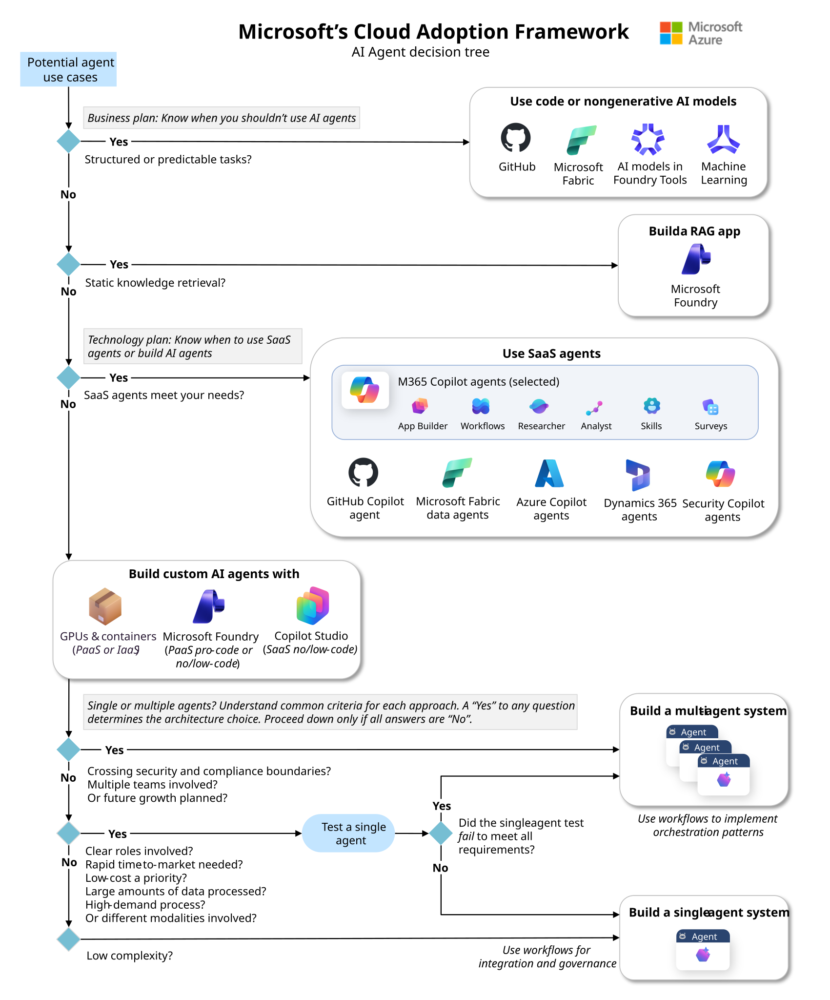
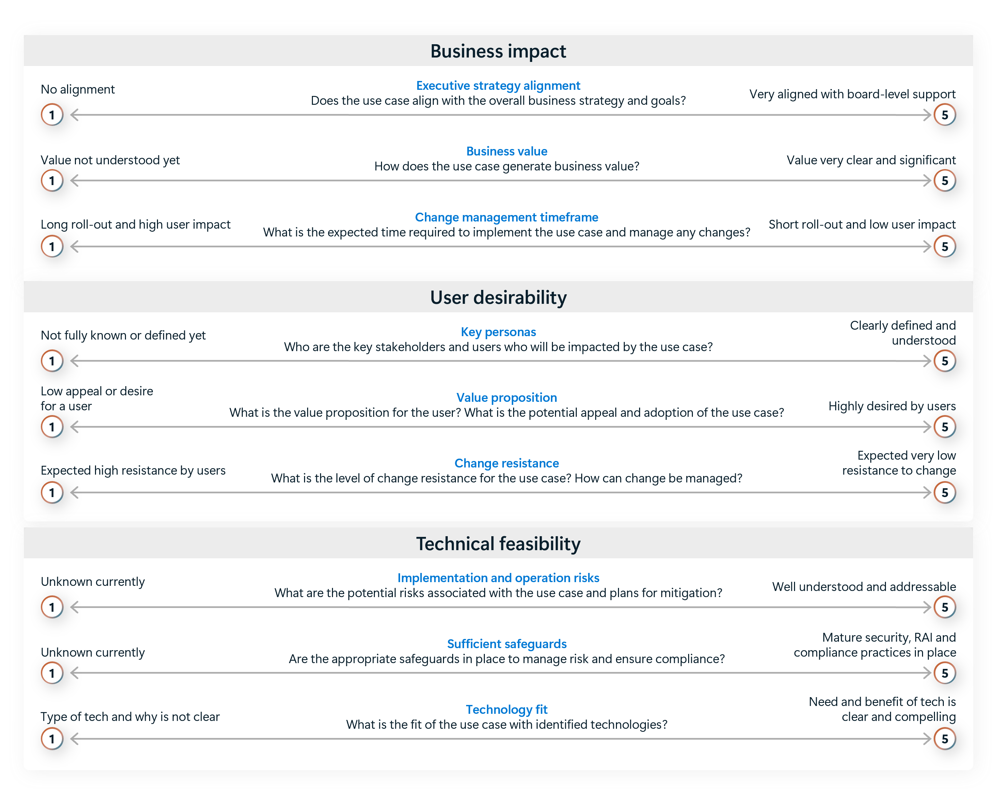

<!-- markdownlint-disable MD025 -->

<!-- markdownlint-disable-next-line MD022 -->
# Quick Reference: Technology by Need
{: .no_toc }

{: .warning }
> **Important: Use This as a Validation Tool, Not a Shortcut**
>
> These tables help you validate technology choices **after** you've completed the [Decision Framework]({{ '/docs/decision-framework' | relative_url }}) assessment. Selecting technologies without understanding your Business requirements, user eXperience needs, and Technology constraints often leads to suboptimal outcomes: either overpowered solutions that exceed budget, or underpowered solutions requiring costly rewrites.
>
> **First time here?** Start with [Decision Framework]({{ '/docs/decision-framework' | relative_url }}) to build a systematic approach to technology selection.

<!-- markdownlint-disable-next-line MD022 -->
## Table of contents
{: .no_toc .text-delta }

1. TOC
{:toc}

## CAF Agent Adoption Quick Cues

- **Phases in one line:** Plan for agents (business + tech + org + data), Govern & secure agents (responsible AI, controls, environment prep), Build agents (single vs multi, orchestrate, secure process), Manage agents (integrate, monitor, retire). [CAF AI agent adoption](https://learn.microsoft.com/en-us/azure/cloud-adoption-framework/ai-agents/).
- **When not to use an agent:** Highly deterministic workflows or static Q&A/content generation → use code or plain RAG. [Business plan](https://learn.microsoft.com/en-us/azure/cloud-adoption-framework/ai-agents/business-strategy-plan).
- **SaaS vs build:** Use SaaS agents when they meet requirements; if not, prototype on Foundry or Copilot Studio before committing to custom builds. [Technology plan](https://learn.microsoft.com/en-us/azure/cloud-adoption-framework/ai-agents/technology-solutions-plan-strategy).
- **Single vs multi:** Start single; go multi-agent only for hard security/compliance boundaries, distinct owning teams, or planned modular growth. [Single vs multiple](https://learn.microsoft.com/en-us/azure/cloud-adoption-framework/ai-agents/single-agent-multiple-agents).
- **Prioritize use cases fast:** Score business impact, feasibility, desirability; pick high-impact, low-friction pilots first.
- **Org roles:** Platform owns guardrails, workload teams own use cases and data, AI CoE advises and standardizes. [Organizational readiness](https://learn.microsoft.com/en-us/azure/cloud-adoption-framework/ai-agents/organization-people-readiness-plan).
- **Build safely:** Use workflows for deterministic control, treat instructions as versioned config, gate tool calls, isolate memory per role/tenant, and run evaluations before production. [Build process](https://learn.microsoft.com/en-us/azure/cloud-adoption-framework/ai-agents/build-secure-process).
- **Operate with evidence:** Keep an agent inventory/identity, centralize logging, track cost and quotas, red team regularly, retire unused agents. [Manage agents](https://learn.microsoft.com/en-us/azure/cloud-adoption-framework/ai-agents/integrate-manage-operate).

*CAF decision tree: SaaS first, then build; validate single vs multi during planning.*

---

*Use impact × feasibility × desirability to rank pilots.*

**Ground agents in governed data.** Anchor retrieval in OneLake, Fabric, and Foundry rather than in copies, and give each workload a clear landing zone. See [Grounded Q&A over enterprise content]({{ '/docs/scenarios#scenario-1-grounded-qa-over-enterprise-content' | relative_url }}) for the retrieval decision, and [CAF: AI strategy](https://learn.microsoft.com/en-us/azure/cloud-adoption-framework/ai/) for the data-strategy stage.

**Sources (CAF):**

- [AI agent adoption](https://learn.microsoft.com/en-us/azure/cloud-adoption-framework/ai-agents/) (Updated: 2025-12-01)
- [Business plan for AI agents](https://learn.microsoft.com/en-us/azure/cloud-adoption-framework/ai-agents/business-strategy-plan) (Updated: 2025-12-01)
- [Technology plan for AI agents](https://learn.microsoft.com/en-us/azure/cloud-adoption-framework/ai-agents/technology-solutions-plan-strategy) (Updated: 2025-12-01)
- [Organizational readiness for AI agents](https://learn.microsoft.com/en-us/azure/cloud-adoption-framework/ai-agents/organization-people-readiness-plan) (Updated: 2025-12-01)
- [Single agent or multiple agents](https://learn.microsoft.com/en-us/azure/cloud-adoption-framework/ai-agents/single-agent-multiple-agents) (Updated: 2025-12-01)
- [Process to build agents across your organization](https://learn.microsoft.com/en-us/azure/cloud-adoption-framework/ai-agents/build-secure-process) (Updated: 2025-12-01)
- [Manage AI agents across your organization](https://learn.microsoft.com/en-us/azure/cloud-adoption-framework/ai-agents/integrate-manage-operate) (Updated: 2025-12-01)

---

## Lifecycle Status Quick Reference

Active migration deadlines and forced transitions. If your project timeline crosses a deadline below, migration planning is mandatory.

| Technology / API | Current Status | Deadline | Successor | Action |
| --- | --- | --- | --- | --- |
| `azure-ai-inference` SDK | **Deprecated** | May 30, 2026 | `openai` SDK (standard `OpenAI()` client) | **Migrate now** |
| Assistants API | **Deprecated** | Aug 26, 2026 (date **unconfirmed** against current Microsoft Learn, verify before planning) | Foundry Agents Service (Responses API) | **Plan migration.** [migration tool](https://aka.ms/agent/migrate/tool) available |
| Classic agents (v1) | **Deprecated** | Mar 31, 2027 (date **unconfirmed** against current Microsoft Learn, verify before planning) | Foundry Agents v2 (`create_version()`) | **Plan migration.** [migration guide](https://learn.microsoft.com/en-us/azure/foundry/agents/how-to/migrate#migrate-classic-agents-to-new-agents) |
| Foundry Workflows | **Retiring from Preview without a GA path on December 1, 2026** | Dec 1, 2026 | Role-dependent: Agent Framework, Logic Apps, A2A, or exported YAML on [Hosted Agents (mixed maturity)]({{ '/docs/technologies#the-hosted-agent-constraint-card' | relative_url }}) | **Do not start new solutions.** Map code-first orchestration, visual process, direct delegation, and hosted YAML separately |
| Classic Foundry portal | **Legacy** | Ongoing | Foundry (new) portal | **Transition.** Classic and new lack feature parity |
| Bot Framework | **Retired** | Dec 31, 2025 (passed) | M365 Agents SDK + Toolkit | **Complete** |
| `azure-ai-agents` SDK | **Deprecated** | March 2026 | `AIProjectClient` in `azure-ai-projects` 2.x | **Remove** standalone `azure-ai-agents` pin; use `project_client.get_openai_client()` for agent responses |
| `azure-ai-projects` 1.x | **Legacy** | Aligns with classic portal | `azure-ai-projects` 2.x (GA: Python 2.0.1, Java 2.0.0; Beta: .NET 2.0.0-beta.1) | **Upgrade.** 2.x targets the new Foundry portal and is the investment direction |
| Semantic Kernel (standalone) | **Maintenance** | Security patches only | Microsoft Agent Framework | **Migrate for new projects** |

**Sources:**

- [Migrate from the Foundry (classic) portal](https://learn.microsoft.com/en-us/azure/foundry/how-to/navigate-from-classic) (Retrieved: 2026-03-19)
- [Migrate to the new agents developer experience](https://learn.microsoft.com/en-us/azure/foundry/agents/how-to/migrate) (Retrieved: 2026-03-19)

---

## Publish Target Quick Reference

Where can your agent appear? Match build platform to distribution surface.

| Agent Built In | Can Publish To |
| --- | --- |
| **Foundry Agent Service** | M365 Copilot (one-click), Teams, custom app (Responses API), Agent 365 digital worker (Frontier) |
| **Copilot Studio** | M365 Copilot, Teams, web, WhatsApp, custom channels, messaging channels via Azure Communications |
| **M365 Agent Builder** | M365 Copilot (copy to Copilot Studio for deeper customization) |
| **M365 Agents SDK** | M365 Copilot, Teams, web, email, SMS, custom channels (10+ via channel adapters) |
| **Agent Framework** | Custom apps, web APIs, AG-UI protocol (Preview); surface via M365 Agents SDK for Copilot/Teams |

**Sources:**

- [Publish agents to Microsoft 365 Copilot and Teams](https://learn.microsoft.com/en-us/azure/foundry/agents/how-to/publish-copilot) (Updated: 2026-07-10)
- [Publish an agent to WhatsApp](https://learn.microsoft.com/en-us/microsoft-copilot-studio/publication-add-bot-to-whatsapp) (Retrieved: 2026-08-17)

---

## Technology by User Experience

| **Where Users Interact** | **Recommended Technologies** | **Use When** |
| --- | --- | --- |
| **Microsoft 365 Apps** | **Free** Microsoft 365 Copilot Chat (included) + Copilot connectors (Graph connectors) for baseline pilots; Microsoft 365 Copilot add-on + declarative agents for work-grounded copilots; **Frontier Word/Excel/PowerPoint creation agents (Preview)** require admin Frontier opt-in[^frontier-qr] and Anthropic data-sharing consent; mobile parity for custom engine/message-extension agents (iOS/Android)[^mobile-ext-qr]; Copy to Copilot Studio copies data sources/actions but GPTs/custom actions must be reattached[^copy-to-studio-qr] | Need managed copilots embedded in Word, Excel, Outlook, or Teams with tenant-level governance. Start with the free chat surface and graduate to the add-on when Graph grounding or in-app assistants are required; use Frontier creation agents only for controlled pilots |
| **Always-On Personal Agent (Experimental, Frontier)** | **Microsoft Scout (Experimental, Frontier)** - always-on personal agent for background coordination; requires Frontier enrollment, Intune policy configuration, and a GitHub Copilot Business/Enterprise license alongside an active Microsoft 365 Copilot license[^autopilots-qr] | Need a proactively acting, always-on personal agent to coordinate meetings, block calendar time, and surface risks across Teams, Outlook, OneDrive, and SharePoint without prompt-driven interaction |
| **Microsoft Teams Only** | Teams SDK, Copilot Studio, M365 Agents SDK | Teams-centric chat, channels, meetings, or calling scenarios where admins may enforce "only during the call" retention |
| **Custom Web/Mobile App** | Microsoft Foundry, Microsoft Foundry Agent Service (Standard setup) | Building standalone applications while keeping files, search, and thread storage in customer-owned Azure resources |
| **Governance / Registry** | Microsoft Agent 365 (**GA 2026-05-01**; per-user, E5 recommended prerequisite, included in M365 E7; Agent 365 SDK and CLI remain Preview)[^agent365-sdk-qr][^agent365-cli-qr]; Foundry Control Plane; M365 Agent Registry[^agent-registry-qr]; Agent Governance Toolkit v4.1.0 (**Public Preview OSS middleware; zero GA features**) | Compose fleet governance with application-layer enforcement; AGT is not a managed registry or service |
| **Custom Web/Mobile UI with streaming** | Microsoft Agent Framework + AG-UI protocol (Preview) | Need Server-Sent Events streaming, backend tool rendering, shared state, and human approvals in bespoke front-ends |
| **Multiple Channels** | M365 Agents SDK | Deliver one agent across Microsoft 365 Copilot, Teams, web, email, SMS, and other channels |
| **Power Platform** | Copilot Studio, AI Builder | Integrated with low-code Power Apps/Power Automate workloads |
| **Enterprise Workflows** | Azure Logic Apps **agentic workflows** with an **agent loop** (Consumption **explicitly in preview**; Standard carries no preview banner on the agent loop, but Microsoft never states Standard is GA and some Standard capabilities are marked preview; check the exact capability), MCP Server | Workflow automation that needs autonomous/conversational agent patterns with Easy Auth guardrails |
| **Data Grounding / RAG** | Microsoft IQ: Foundry IQ (mixed GA/Preview), Work IQ (**APIs GA**; **Work IQ MCP is Preview**), Fabric IQ (**Preview** workload), Web IQ (Limited Access); Copilot connectors (M365); Microsoft 365 Copilot Search API (Preview) for OneDrive hybrid semantic+lexical search[^search-api-qr] | Match the grounding layer to the data domain: enterprise documents (Foundry IQ), work context (Work IQ), business semantics (Fabric IQ), public web (Web IQ), tenant-scoped content (Connectors), or hybrid OneDrive search (Search API) |
| **Developer Tools** | GitHub Copilot in the IDE; **Copilot cloud agent** (async, renamed from "coding agent"); MCP servers | IDE and development workflow integration. Note: GitHub App-based Copilot Extensions were deprecated **2025-11-10** with **MCP servers** as the migration target; client-side VS Code Copilot Extensions remain supported |

**Sources:**

- [Copilot for all: Introducing Microsoft 365 Copilot Chat](https://www.microsoft.com/en-us/microsoft-365/blog/2025/01/15/copilot-for-all-introducing-microsoft-365-copilot-chat/) (Updated: 2025-01-15)
- [Microsoft 365 Copilot release notes - November 25, 2025](https://learn.microsoft.com/en-us/microsoft-365/copilot/release-notes#november-25,-2025)
- [Built-in enterprise readiness with standard agent setup](https://learn.microsoft.com/en-us/azure/foundry/agents/concepts/standard-agent-setup) (Updated: 2026-02-27)
- [Overview of Microsoft Agent 365](https://learn.microsoft.com/en-us/microsoft-agent-365/overview) (Retrieved: 2026-06-08)
- [Microsoft IQ overview](https://learn.microsoft.com/en-us/microsoft-iq/) (Retrieved: 2026-06-08)
- [Introducing Microsoft Scout](https://www.microsoft.com/en-us/microsoft-365/blog/2026/06/02/introducing-microsoft-scout-your-always-on-personal-agent/) (Published: 2026-06-02)
- [Microsoft Agent 365 SDK](https://learn.microsoft.com/en-us/microsoft-agent-365/developer/agent-365-sdk) (Retrieved: 2026-01-09)
- [Agent 365 CLI](https://learn.microsoft.com/en-us/microsoft-agent-365/developer/agent-365-cli) (Retrieved: 2026-01-13)
- [What is Microsoft Entra Agent ID?](https://learn.microsoft.com/en-us/entra/agent-id/what-is-microsoft-entra-agent-id): generally available; *"available for all Microsoft Entra customers"*
- [Agent Registry in the Microsoft 365 admin center](https://learn.microsoft.com/en-us/microsoft-365/admin/manage/agent-registry?view=o365-worldwide#admin-actions-to-manage-agents) (Updated: 2026-01-23)
- [Foundry Control Plane overview](https://learn.microsoft.com/en-us/azure/foundry/control-plane/overview) (Updated: 2026-02-27)
- [Azure AI Search what's new](https://learn.microsoft.com/en-us/azure/search/whats-new#2025-announcements) (Updated: 2026-03-13)
- [Microsoft 365 Copilot Search API overview](https://learn.microsoft.com/en-us/microsoft-365/copilot/extensibility/api/ai-services/search/overview) (Updated: 2025-10-20)
- [Workflows with AI agents and models in Azure Logic Apps](https://learn.microsoft.com/en-us/azure/logic-apps/agent-workflows-concepts): official term "agentic workflows"; Consumption explicitly in preview (Updated: 2026-02-19)
- [Copilot cloud agent](https://docs.github.com/en/copilot/concepts/agents/cloud-agent/about-cloud-agent): GA on paid plans including Student; not on Copilot Free
- [Microsoft 365 Agents Toolkit](https://learn.microsoft.com/en-us/microsoftteams/platform/toolkit/overview-agents-toolkit) (Updated: 2026-01-29)
- [AG-UI integration with Agent Framework](https://learn.microsoft.com/en-us/agent-framework/integrations/by-component/ui/ag-ui/) (Preview, Updated: 2025-11-07)
- [Declarative Agents for Microsoft 365 Copilot overview](https://learn.microsoft.com/en-us/microsoft-365/copilot/extensibility/overview-declarative-agent) (Updated: 2025-12-01)

**Confidence Level:** High for placement guidance; status varies by capability and should be verified in the linked Microsoft Learn pages before production planning.

[^mobile-ext-qr]: Mobile parity for custom engine agents and message-extension agents on iOS/Android. Source: Microsoft 365 Copilot release notes (November 24, 2025).
[^frontier-qr]: Copilot Frontier is the early access program for experimental and preview features in Copilot apps and agents; enable via Microsoft 365 admin center > Copilot > Settings > User access > Copilot Frontier. Source: Manage Microsoft 365 Copilot scenarios (Retrieved: 2026-03-16).
[^agent-registry-qr]: Agent Registry lifecycle actions in M365 admin center: publish, activate, deploy, pin, block, remove, delete, reassign owner, export inventory. Source: Agent Registry documentation (Updated: 2026-01-23).
[^agent365-sdk-qr]: Agent 365 SDK (Preview) extends agents with Entra-backed identity, notifications, OpenTelemetry observability, and governed MCP servers. Agent 365 platform is GA; SDK remains Preview. Source: Agent 365 SDK (Retrieved: 2026-01-09).
[^agent365-cli-qr]: Agent 365 CLI (Preview) is a cross-platform CLI for deploying and managing Agent 365 apps on Azure; install via dotnet tool with `--prerelease`. Agent 365 platform is GA; CLI remains Preview. Source: Agent 365 CLI (Retrieved: 2026-01-13).
[^search-api-qr]: Microsoft 365 Copilot Search API (Preview) for hybrid semantic + lexical search across OneDrive via Graph `/beta`. Source: Search API overview (Updated: 2025-10-20).
[^copy-to-studio-qr]: Copy to Copilot Studio copies agent data sources and actions; GPTs and custom actions must be reattached. Feature availability may vary by tenant. Source: Declarative Agents overview (Updated: 2025-12-01).
[^m365-memory-qr]: Microsoft 365 Copilot user-level memory allows personalized experiences based on user preferences and context. This is distinct from org-wide conversation logging; memory is user-controlled, while conversation history follows Purview retention policies. Source: Data, privacy, and security for Microsoft 365 Copilot (Updated: 2026-01-07).
[^autopilots-qr]: **A word on "Autopilots."** The term appears only in a Microsoft 365 marketing blog (2026-06-02). There is **no Microsoft Learn page defining it**, so it is not a documented agent category and should not be used to build a taxonomy or a purchasing decision. Scout is the single named illustration. Separately, do not confuse any of this with **Windows Autopilot**, the long-standing Windows device provisioning service. Unrelated product, unrelated problem space. Microsoft Learn defines Scout as a desktop AI application for Windows 11 and macOS 12+ in Frontier/private preview; the Teams interaction surface is blog-sourced only.

---

## Agentic Retrieval Quick Facts

- Knowledge agents are now **knowledge bases**. Agentic retrieval is **GA via the `2026-04-01` REST API**; **portal experiences remain preview-only**, as do answer synthesis, multi-turn retrieval, and newer source types.
- Knowledge sources (Preview): indexed SharePoint, remote SharePoint (Copilot Retrieval API, ACL-trimmed), indexed OneLake, web/Bing, search index, Azure Blob; `ingestionParameters` wraps embeddings/chat models/Content Understanding; portal creates `2025-08-01-preview` objects. Migrate to `2025-11-01-preview`.
- Semantic ranker is available on **free tier** (quota limits); enable on the service before using KBs.
- Hybrid/vector preview (`2024-09-01-preview`): MRL `truncationDimension`, `filterOverride` for vector-only filters, `debug` subscores for RRF, token-based Text Split parameters.
- Content Understanding skill (Preview) replaces Text Split for richer chunking; billed to Foundry resource when used via `contentExtractionMode`.

**Sources:**

- [Azure AI Search what's new](https://learn.microsoft.com/en-us/azure/search/whats-new#2025-announcements) (Updated: 2026-03-13)
- [Retrieval-augmented generation with Azure AI Search](https://learn.microsoft.com/en-us/azure/search/retrieval-augmented-generation-overview) (Updated: 2026-01-15)
- [Azure AI Content Understanding](https://learn.microsoft.com/en-us/azure/ai-services/content-understanding/overview) (Updated: 2025-12-19)
- [Built-in enterprise readiness with standard agent setup](https://learn.microsoft.com/en-us/azure/foundry/agents/concepts/standard-agent-setup) (Updated: 2026-02-27)

## Agent Development Approach Comparison

| **Approach** | **Declarative Agents** | **Custom Engine Agents** |
| --- | --- | --- |
| **Definition** | Microsoft-managed orchestration where you supply instructions, knowledge, actions | Bring your own orchestration, models, and tooling for bespoke agents |
| **Best For** | Rapid delivery of guided experiences in M365 apps | Advanced workflows, multi-agent patterns, or non-M365 channels |
| **Development Model** | Low-code (Copilot Studio) or pro-code via Agents Toolkit scaffolding | Pro-code using Agents SDK, Teams SDK, or custom frameworks |
| **Orchestration** | Microsoft 365 Copilot orchestrator handles planning and grounding | You decide orchestration (Semantic Kernel, LangChain, Teams AI action planner, etc.) |
| **M365 Integration** | Native to Microsoft 365 Copilot UI, Teams, and SharePoint | Requires explicit integration via M365 Agents SDK or Teams SDK |
| **Typical Timeline** | Days to a few weeks | Weeks to months |
| **Skill Level** | Makers or full-stack developers | Professional developers |
| **Availability** | GA | GA |

**Sources:**

- [Declarative agents for Microsoft 365 Copilot overview](https://learn.microsoft.com/en-us/microsoft-365/copilot/extensibility/overview-declarative-agent) (Updated: 2025-12-01)
- [Custom engine agents for Microsoft 365 overview](https://learn.microsoft.com/en-us/microsoft-365/copilot/extensibility/overview-custom-engine-agent) (Updated: 2026-07-02)

**Confidence Level:** High (official Microsoft guidance)

---

## Custom Engine Agent Tool Comparison

Teams SDK and M365 Agents SDK coexist with differentiated fit: Teams SDK for Teams-native collaborative experiences, M365 Agents SDK for broader multi-channel distribution and custom orchestration portability.

| **Tool / Mode** | **Copilot Studio (standard harness)** | **Copilot Studio (GitHub Copilot harness)** | **Teams SDK** | **M365 Agents SDK** |
| --- | --- | --- | --- | --- |
| **Primary Use Case** | Structured conversational flows with deterministic branch control | Reasoning-heavy agents and workflows that complete multi-step business processes | Collaborative agents inside Teams | Pro-code agents running across M365 and third-party channels |
| **Orchestration** | Topics plus generative orchestration | Enhanced orchestration runtime reasoning over instructions, knowledge, tools, memory, and skills | Built-in Teams AI action planner | Bring your own orchestration (Semantic Kernel, LangChain, custom) |
| **Supported Channels** | Microsoft 365 Copilot, Teams, partner apps, mobile apps, custom websites | Microsoft 365 Copilot, Teams, partner apps, mobile apps, custom websites | Microsoft 365 Copilot, Teams | Microsoft 365 Copilot, Teams, web, email, SMS, Office add-ins, custom sites |
| **Development Experience** | Low-code UI with Power Platform controls | Low-code UI with component authoring, native file creation, and evaluation loops | Visual Studio/VS Code libraries for C#, TS/JS, Python | Agents Toolkit scaffolding for .NET/JS with multi-channel deployment |
| **Ideal Team** | Makers or fusion dev teams preferring explicit flow control | Makers or fusion teams needing adaptive reasoning with managed platform controls | Teams-focused pro dev squads | Professional developers delivering enterprise-scale agents |
| **Classic Topics Support** | Yes | No (use skills, instructions, and tools instead) | N/A | N/A |
| **Billing starts** | After publish | **When you start building** | Per your hosting | Per your hosting |
| **Status** | GA | GA (2026-08-03) | GA | GA |

{: .note }
> **The harness is chosen at creation and an agent cannot move between harnesses.** Microsoft states that agents created on the GitHub Copilot harness *"can't be transferred to the standard harness, and vice versa."* Reuse works best *within* a harness: on the GitHub Copilot harness, **skills** export as Markdown packages and import into other agents there. Skills are specific to that harness, so what carries across all three is more basic, namely instructions, knowledge sources, and connectors. See [Technologies]({{ '/docs/technologies' | relative_url }}) for the full comparison.

{: .note }
> Feature maturity can change quickly for Studio orchestration components and channel capabilities. Reconfirm per-feature GA/Preview in current Microsoft Learn release notes before rollout.

**Sources:**

- [Custom engine agents for Microsoft 365 overview](https://learn.microsoft.com/en-us/microsoft-365/copilot/extensibility/overview-custom-engine-agent) (Updated: 2026-07-02)
- [Microsoft 365 Agents Toolkit](https://learn.microsoft.com/en-us/microsoftteams/platform/toolkit/overview-agents-toolkit) (Updated: 2026-01-29)
- [Teams SDK welcome](https://learn.microsoft.com/en-us/microsoftteams/platform/teams-sdk/welcome) (Updated: 2026-07-07)
- [Create and deploy with Microsoft 365 Agents SDK](https://learn.microsoft.com/en-us/microsoft-365/copilot/extensibility/create-deploy-agents-sdk) (Updated: 2025-12-02)
- [New Orchestrator, New Rules? CAT's Got You](https://microsoft.github.io/mcscatblog/posts/new-orchestrator-resources/) (Updated: 2026-07-15)

**Confidence Level:** High (all GA, official Microsoft documentation)

---

## Data Grounding Pattern by Source

| **Data Source Type** | **Recommended Approach** | **Technologies** |
| --- | --- | --- |
| **SharePoint/OneDrive** | Copilot connectors (Graph connectors) | Microsoft Graph Connectors SDK, Copilot Studio connectors |
| **External Structured Data** | Copilot connectors (inside M365) or Azure AI Search (Microsoft Foundry Agent Service standard setup) | Copilot connectors, Azure AI Search |
| **Unstructured Documents** | Vector search with chunking | Azure AI Search, Azure OpenAI Embeddings |
| **Real-Time Transactional Data** | API-based grounding | API plugins, Functions, Logic Apps agent workflows |
| **Multimodal Content** | Azure AI Content Understanding (Preview) | Process documents, images, audio, video with reasoning |
| **Database Vectors** | AI-capable databases with managed embeddings | Azure Cosmos DB for NoSQL (flat, quantized flat, DiskANN; standard setup: 3 × 1000 RU containers; **no GA date stated in docs**), Azure Database for PostgreSQL (**pgvector GA**, plus `azure_ai` for in-database embeddings), Azure SQL Database / SQL MI / SQL Server 2025 / SQL database in Fabric (**`VECTOR_SEARCH` is Preview on all three platforms**) |
| **Microsoft Fabric Platform** | Direct data access | Lakehouse (Delta tables), Warehouse (T-SQL), OneLake (ADLS Gen2 APIs), SQL analytics endpoint |
| **Microsoft Fabric via Agent** | Conversational data layer | **Fabric data agent (GA**, formerly "AI skill"; requires F2+ or P1+ capacity) with Copilot Studio or Microsoft Foundry Agent Service |

**Sources:**

- [Microsoft 365 Copilot connectors overview](https://learn.microsoft.com/en-us/microsoft-365/copilot/extensibility/overview-copilot-connector) (Updated: 2026-02-25)
- [Retrieval-augmented generation with Azure AI Search](https://learn.microsoft.com/en-us/azure/search/retrieval-augmented-generation-overview) (Updated: 2026-01-15)
- [Azure AI Content Understanding](https://learn.microsoft.com/en-us/azure/ai-services/content-understanding/overview) (Updated: 2025-12-19)
- [Built-in enterprise readiness with standard agent setup](https://learn.microsoft.com/en-us/azure/foundry/agents/concepts/standard-agent-setup) (Updated: 2026-02-27)
- [Azure Cosmos DB integration with Microsoft Foundry Agent Service](https://learn.microsoft.com/en-us/azure/cosmos-db/gen-ai/azure-agent-service) (Updated: 2026-02-23)
- [Workflows with AI agents and models in Azure Logic Apps](https://learn.microsoft.com/en-us/azure/logic-apps/agent-workflows-concepts): "agentic workflows"; Consumption explicitly in preview (Updated: 2026-02-19)
- [Microsoft Fabric overview](https://learn.microsoft.com/en-us/fabric/fundamentals/microsoft-fabric-overview) (Updated: 2026-03-18)
- [Fabric data agent concept](https://learn.microsoft.com/en-us/fabric/data-science/concept-data-agent): GA; F2+/P1+ capacity
- [`VECTOR_SEARCH` (Transact-SQL)](https://learn.microsoft.com/en-us/sql/t-sql/functions/vector-search-transact-sql): Preview on Azure SQL Database, SQL database in Fabric, and SQL Server 2025
- [Use pgvector on Azure Database for PostgreSQL](https://learn.microsoft.com/en-us/azure/postgresql/extensions/how-to-use-pgvector): GA
- [Microsoft Foundry FAQ](https://learn.microsoft.com/en-us/azure/foundry-classic/faq?view=foundry-classic) (Updated: 2026-01-23)

**Confidence Level:** High for GA technologies (Fabric data agent, pgvector); Medium for Preview capabilities (`VECTOR_SEARCH`, Content Understanding)

---

## Developer Loop Quick Reference

One agent, four handoffs. This is the relay race a developer's work actually runs: from the keyboard, to the cloud, to a governed runtime. Each leg has a different baton.

| Leg | Surface | Status | What it is for |
| --- | --- | --- | --- |
| **1. Inner loop** | GitHub Copilot in the IDE | GA | Synchronous, developer-in-the-seat editing and chat |
| **2. Async loop** | **Copilot cloud agent** (renamed from "coding agent") | GA on paid plans **including Student; not available on Copilot Free** | Hand off an issue or prompt; the agent works on a branch and opens a pull request |
| **3. Behavior as config** | Custom agents (`.md` with YAML front matter) + **`AGENTS.md`** agent instructions | Custom agents GA for cloud agent, VS Code, and Visual Studio; Public Preview for JetBrains/Eclipse/Xcode | Version your agent's personality and rules alongside the code. GitHub's own caveat: agent instructions are *"currently not supported by all Copilot features"* |
| **4. Embed it in your product** | **GitHub Copilot SDK** | **GA**: Python, TypeScript, Go, .NET, Java, Rust | Wraps the Copilot CLI engine over JSON-RPC. BYOK to OpenAI, Microsoft Foundry, or Anthropic; Entra/managed identity works via `bearerTokenProvider` composition with the Azure Identity SDK |
| **5. Run it under governance** | **Microsoft Foundry Hosted Agents** | See the [Hosted Agent constraint card]({{ '/docs/technologies#the-hosted-agent-constraint-card' | relative_url }}) | Managed endpoint, scaling, identity, and observability for your own agent container |

{: .warning }
> **The seam that bites: Foundry Hosted agents support Python and C# only.**
>
> Microsoft Foundry does list the GitHub Copilot SDK among the frameworks you can bring to a Hosted agent. But the hosted-agent runtime states plainly: *"Hosted agents support Python and C#."* So a **Go, Rust, or Java** Copilot SDK agent is **not directly hostable on Foundry Hosted Agents**. You host it yourself (Azure Container Apps, AKS, or your own runtime) and integrate via the Responses API. Choose your SDK language with the hosting endgame in mind, not the other way round.

**Sources:**

- [About the Copilot cloud agent](https://docs.github.com/en/copilot/concepts/agents/cloud-agent/about-cloud-agent)
- [About custom agents](https://docs.github.com/en/copilot/concepts/agents/cloud-agent/about-custom-agents)
- [Copilot response customization (agent instructions / `AGENTS.md`)](https://docs.github.com/en/copilot/concepts/prompting/response-customization)
- [GitHub Copilot SDK: getting started](https://docs.github.com/en/copilot/how-tos/copilot-sdk/getting-started)
- [Microsoft Foundry Agent Service overview](https://learn.microsoft.com/en-us/azure/foundry/agents/overview): lists the GitHub Copilot SDK as a hosted-agent framework
- [Hosted agents concepts](https://learn.microsoft.com/en-us/azure/foundry/agents/concepts/hosted-agents): language support statement

---

## Data Plane Quick Reference

Grounding is not one product. It is a shelf of stores with different shapes, different guarantees, and, critically, different maturity labels.

| Store | Retrieval capability | Status | Pick it when |
| --- | --- | --- | --- |
| **Azure AI Search** (name unchanged) | Agentic retrieval, hybrid, vector, semantic ranking | Agentic retrieval **GA via the `2026-04-01` REST API**; **portal experiences remain preview-only** | You need governed enterprise retrieval with ACL/label enforcement; it is the engine underneath Foundry IQ |
| **Azure Database for PostgreSQL** | `pgvector` similarity search; `azure_ai` extension for in-database embeddings and LLM calls | **pgvector GA** | Your operational data already lives in Postgres and you want retrieval next to it. Note: there is **no "PostgreSQL agent" product** |
| **Azure Cosmos DB** | Vector search: flat/kNN, quantized flat, **DiskANN**; must be enabled as a feature | **No GA date stated in the docs**; ultra-high-throughput vector search is Private Preview | Globally distributed transactional data that also needs vector lookup |
| **Azure SQL / SQL MI / SQL Server 2025 / SQL database in Fabric** | `VECTOR_SEARCH()` over the native `vector` type | **`VECTOR_SEARCH` is Preview on all three platforms** (SQL Server 2025 also needs the `PREVIEW_FEATURES` database-scoped configuration; `TOP_N` is deprecated) | Your system of record is SQL and you want retrieval without a second datastore, with eyes open about preview status |
| **Microsoft Fabric / OneLake** | Fabric data agent over lakehouse, warehouse, KQL, semantic models | **Fabric data agent GA** (formerly "AI skill"), F2+/P1+ capacity; **Fabric IQ is a Preview workload** | The question is analytical ("what happened, and why") rather than document lookup |
| **Azure Managed Redis** | Vector and cache-side retrieval | **GA**, Entra-native, built on Redis Enterprise | You need low-latency semantic caching or session state beside the agent |

{: .note }
> **Infrastructure deadline worth putting on the calendar:** Azure Cache for Redis **Enterprise and Enterprise Flash retire 2027-03-31** (disabled 2027-04-01); **Basic, Standard, and Premium retire 2028-09-30** (disabled 2028-10-01). Azure Managed Redis is the forward path.

**Sources:**

- [Agentic retrieval in Azure AI Search](https://learn.microsoft.com/en-us/azure/search/agentic-retrieval-overview)
- [Use pgvector on Azure Database for PostgreSQL](https://learn.microsoft.com/en-us/azure/postgresql/extensions/how-to-use-pgvector)
- [Vector search in Azure Cosmos DB for NoSQL](https://learn.microsoft.com/en-us/azure/cosmos-db/vector-search)
- [`VECTOR_SEARCH` (Transact-SQL)](https://learn.microsoft.com/en-us/sql/t-sql/functions/vector-search-transact-sql)
- [Fabric data agent concept](https://learn.microsoft.com/en-us/fabric/data-science/concept-data-agent)
- [Fabric IQ (Preview)](https://learn.microsoft.com/en-us/fabric/iq/)
- [Azure Managed Redis overview](https://learn.microsoft.com/en-us/azure/redis/overview)

---

## Memory & Analytics by Technology

{: .note }
**Common Customer Confusion**: Grounding (RAG) ≠ Memory ≠ Analytics

| Technology | 📋 Grounding (RAG) | 💾 Memory / Thread Storage | 📊 Analytics / Transcripts | Admin Access | Retention Control |
| --- | --- | --- | --- | --- | --- |
| **M365 Copilot** | ✅ M365 content per request | ⚠️ User-level memory[^m365-memory-qr]; user history lives in mailbox/Graph | ⚠️ Copilot activity history, Teams call summaries if policy allows | ⚠️ Purview/eDiscovery only | ✅ Purview retention policies; Teams calling policy can force "only during the call" |
| **Copilot Studio** | ✅ M365 data, Dataverse, connectors | ⚠️ Dataverse variables per conversation | ✅ Session reports, transcript downloads, ROI analytics | ✅ Transcript Viewer role required | ✅ Toggle Dataverse save, default 30-day retention, bulk delete |
| **Microsoft Foundry Agent Service** | ✅ Azure AI Search, Cosmos DB, Fabric, tools | ✅ BYO thread storage in Cosmos DB (standard setup) | ⚠️ Custom telemetry (App Insights, OpenTelemetry) | ✅ Customer RBAC on Azure resources | ✅ Customer deletes threads/files in own storage |
| **M365 Agents SDK** | ✅ Custom (developer implements) | ⚠️ Custom (developer implements thread storage) | ⚠️ Custom (Application Insights, custom logging) | ⚠️ Custom (developer implements) | ⚠️ Custom (developer implements) |

**Key Compliance Questions:**

- **Where is conversation history stored?** → M365 Copilot (user mailbox/Purview, plus user-level memory), Copilot Studio (Dataverse), Microsoft Foundry Agent Service (customer Cosmos DB), SDK (customer datastore)
- **How long is it retained?** → M365 Copilot (Purview retention or user deletion), Copilot Studio (policy configurable, 30-day default), Microsoft Foundry Agent Service (customer-defined lifecycle), SDK (custom)
- **Who can query chat logs?** → M365 Copilot (admins via eDiscovery, users see activity history), Copilot Studio (admins with Transcript Viewer role), Microsoft Foundry Agent Service (Azure RBAC), SDK (custom controls)
- **Can we scrub PII?** → Microsoft Foundry Agent Service (customer deletes in Cosmos/Storage), Studio (bulk delete transcripts), M365 Copilot (user clears activity history, Purview retention)
- **Can we run without saved transcripts?** → Teams calling "Only during the call" mode keeps speech-to-text transient; Copilot Studio toggle stops Dataverse saving.

**Sources:**

- [Data, privacy, and security for Microsoft 365 Copilot](https://learn.microsoft.com/en-us/microsoft-365/copilot/microsoft-365-copilot-privacy) (Updated: 2026-01-07)
- [Control transcript access and retention](https://learn.microsoft.com/en-us/microsoft-copilot-studio/admin-transcript-controls) (Updated: 2025-11-10)
- [Manage Microsoft 365 Copilot in Teams calls](https://learn.microsoft.com/en-us/microsoftteams/copilot-teams-calling-transcription) (Updated: 2025-07-01)
- [Built-in enterprise readiness with standard agent setup](https://learn.microsoft.com/en-us/azure/foundry/agents/concepts/standard-agent-setup) (Updated: 2026-02-27)
- [Azure Cosmos DB integration with Microsoft Foundry Agent Service](https://learn.microsoft.com/en-us/azure/cosmos-db/gen-ai/azure-agent-service) (Updated: 2026-02-23)

**Confidence Level:** High (all technologies GA)

---

## Orchestration Complexity Decision Matrix

| **Complexity Level** | **Characteristics** | **Recommended Technologies** |
| --- | --- | --- |
| **Simple (Q&A)** | Static lookup, single-turn answers, basic RAG | Search or classic RAG first; add an agent only for action, adaptation, or open-ended reasoning |
| **Moderate (Task Execution)** | Multi-turn, 1-5 actions, simple branching | Declarative Agents with API plugins; Foundry Prompt Agents when Foundry-managed configuration fits |
| **Complex (Workflows)** | Sequential workflows, conditional logic | Declarative Agents + Power Automate, Agent Framework workflows |
| **Advanced (Multi-Agent)** | Agent-to-agent delegation, parallel execution | Copilot Studio multi-agent (per-feature status varies: the what's-new feed shows "Connect other agents" as **Preview**; Microsoft states no blanket GA); Foundry incoming A2A endpoint (**Preview**) for direct delegation; Agent Framework (**GA core**) for code-first orchestration |
| **Expert (Custom Reasoning)** | Custom orchestration logic, model selection | Custom engine agents with Microsoft 365 Agents SDK, Teams SDK, or Microsoft Foundry Agent Service |

**Component fit heuristic (Copilot Studio, GitHub Copilot harness):**

- If behavior is always true, use **Instructions**.
- If behavior is scenario-specific and repeatable, use a **Skill**.
- If behavior requires exact system actions, use **Tools** plus deterministic workflow and approvals.
- If behavior requires a separate domain owner or trust boundary, consider **Connected agents**.

**Sources:**

- [Microsoft Foundry Agent Service overview](https://learn.microsoft.com/en-us/azure/foundry/agents/overview) (Updated: 2026-01-21)
- [Custom engine agents for Microsoft 365 overview](https://learn.microsoft.com/en-us/microsoft-365/copilot/extensibility/overview-custom-engine-agent) (Updated: 2026-07-02)
- [Microsoft 365 Agents Toolkit](https://learn.microsoft.com/en-us/microsoftteams/platform/toolkit/overview-agents-toolkit) (Updated: 2026-01-29)

**Confidence Level:** High (official patterns documented)

---

## Budget & Timeline Quick Guide

**Timeline Assumptions:** Estimates assume a 2-4 person team with existing Azure or Microsoft 365 tenant, standard use case complexity, and no specialized compliance requirements.

| **Scenario** | **Fastest Path** | **Most Cost-Effective (Long-Term)** |
| --- | --- | --- |
| **Extend M365 Copilot (Knowledge Only)** | Graph Connectors (days) | Graph Connectors (included with Microsoft 365) |
| **Extend M365 Copilot (Knowledge + Actions)** | Declarative Agent (Copilot Studio, 1-2 weeks) | Declarative Agent (M365 Agents Toolkit, 2-4 weeks) |
| **Custom Multi-Channel Agent** | M365 Agents SDK with templates (2-4 weeks) | Microsoft Foundry (consumption-based, 4-8 weeks) |
| **Multi-Agent Orchestration** | Copilot Studio connected agents (**Preview**) for low-code delegation | Agent Framework (**GA core**) for code-first orchestration; Foundry A2A (**Preview**) only for direct delegation |
| **Enterprise Workflow Automation** | Azure Logic Apps agentic workflows (1-2 weeks; Consumption **explicitly in preview**, Standard status not stated by Microsoft) | Microsoft Foundry + Agent Framework (4-8 weeks) |

**Key Budget Considerations:**

- **M365-Centric:** Per-user licensing (Copilot Studio, M365 Copilot add-on)
- **Azure-Native:** Consumption-based (Azure OpenAI tokens, AI Search queries, compute)
- **Hybrid:** Mix of per-user and consumption models
- **Two prepurchase plans, not one:** Microsoft sells **two distinct Azure reservation products**. The **Copilot Credit Pre-Purchase Plan** buys **CCCUs** against eligible Copilot Credit usage. The **Microsoft Agent Prepurchase Plan** buys **ACUs** against *"select services across Microsoft Foundry, Microsoft Copilot Studio\*, Microsoft Fabric, and GitHub costs"* (\* = Copilot Studio, Dynamics 365 first-party agents, and Copilot). **1 ACU pays down US$1 of qualifying retail cost, purchased at a tiered discount.** Coverage of Copilot Cowork and Work IQ is **not stated by Microsoft**. Do not assume it. See [Evaluation Criteria: Budget]({{ '/docs/evaluation-criteria#budget-assessment' | relative_url }})
- **Discount precedence (verbatim):** *"Reservations always apply before prepurchase plans."* The order is **Microsoft Foundry PTU Reservations → Microsoft Fabric Capacity Reservations → Copilot Credit Prepurchase Plan → Microsoft Agent Prepurchase Plan** (applied last, to remaining AI usage across all platforms). The governing principle is simple: **narrow benefits burn before broad benefits.**
- **Hidden Costs:** Team training, governance setup, responsible AI evaluation, ongoing maintenance

### Billing Currencies: The Five Wallets
{: .no_toc }

Microsoft does not have one AI meter. It has five, and they do not convert into each other. Track all of them or your forecast is fiction.

| Wallet | Unit | What it meters | Notes |
| --- | --- | --- | --- |
| **Copilot Credits** | Credit | Microsoft 365 side: agent usage, Copilot Cowork task tiers, Work IQ APIs | Pay-as-you-go at **US$0.01 per credit** |
| **GitHub AI credits** | Credit | GitHub Copilot premium usage | **1 credit = US$0.01.** Copilot Business **1,900**/user/month; Enterprise **3,900**/user/month. A promotional **3,000 / 7,000** allowance runs from 2026-06-01 and **ends 2026-09-01** |
| **Azure consumption** | Tokens, PTU, batch | Microsoft Foundry models and platform services | Pay-per-token, Provisioned Throughput Units, batch, and priority processing |
| **Fabric Capacity Units** | CU | Fabric workloads, including Fabric data agents and Foundry Tools in Fabric | F2 to F8192; Fabric data agents require F2+ or P1+ |
| **Azure SRE Agent AAU** | **AAU** | Azure SRE Agent runtime | **4 AAU per agent-hour** always-on, plus variable usage. (The term is *AAU*; "Azure Agent Units" is not a Microsoft term) |

**Sources:**

- [Copilot Credit Pre-Purchase Plan](https://learn.microsoft.com/en-us/azure/cost-management-billing/reservations/copilot-credit-p3)
- [Microsoft Agent Prepurchase Plan](https://learn.microsoft.com/en-us/azure/cost-management-billing/reservations/agent-pre-purchase)
- [GitHub Copilot billing and AI credits](https://docs.github.com/en/copilot/concepts/billing)
- [Azure SRE Agent pricing and billing](https://learn.microsoft.com/en-us/azure/sre-agent/pricing-billing)

**Sources:**

- [Microsoft Copilot Studio Pricing](https://learn.microsoft.com/en-us/microsoft-copilot-studio/billing-licensing) (Pricing)
- [Foundry Tools Pricing](https://azure.microsoft.com/en-us/pricing/details/foundry-tools/) (Pricing)
- [Azure OpenAI Service Pricing](https://azure.microsoft.com/en-us/pricing/details/azure-openai/) (Token-based consumption)

**Confidence Level:** Medium (pricing models subject to change; verify current rates for production planning)

---

## Governance Decision Quick Reference

| **Requirement** | **M365 Trust Boundary** | **Azure Workload Boundary** |
| --- | --- | --- |
| **Data Residency** | M365 tenant region | Azure region selection |
| **Identity Management** | Entra ID (automatic) | Entra ID + Azure RBAC |
| **Approval Workflows** | M365 admin center (Integrated Apps) | Azure custom workflows |
| **Audit Logging** | Purview + M365 audit logs | Azure Monitor + Log Analytics |
| **Data Classification** | Purview DLP policies | Azure Policy + custom tagging |
| **AI Governance** | Microsoft Purview AI protections (DLP, compliance, audit) | Microsoft Foundry control plane + Azure Policy |
| **Deployment Control** | IT admin approval (tenant-wide settings) | Azure DevOps, CI/CD pipelines |
| **Real-Time Meeting/Call Transcripts** | Teams calling policy can enforce "Only during the call" to avoid post-call storage | Build ephemeral transcript handling or disable logging in custom stack |

{: .note }
**Copilot Studio compliance snapshot:** Covered under HIPAA BAA, HITRUST CSF, FedRAMP High, SOC, ISO 9001/20000-1/22301/27001/27017/27018/27701, PCI DSS, CSA STAR, UK G-Cloud, OSPAR, K-ISMS, Singapore MTCS Level 3, and Spain ENS High (audit artifacts via the Microsoft Service Trust Portal). (Updated: 2024-12-20)

**Best For:**

- **M365 Trust Boundary:** Organizations with strong Microsoft 365 governance already in place
- **Azure Workload Boundary:** Organizations requiring granular control, custom policies, or Azure-native compliance

**Sources:**

- [Data, privacy, and security for Microsoft 365 Copilot](https://learn.microsoft.com/en-us/microsoft-365/copilot/microsoft-365-copilot-privacy) (Updated: 2026-01-07)
- [Manage Microsoft 365 Copilot in Teams calls](https://learn.microsoft.com/en-us/microsoftteams/copilot-teams-calling-transcription) (Updated: 2025-07-01)
- [Azure OpenAI Service data, privacy, and security](https://learn.microsoft.com/en-us/azure/foundry-classic/openai/concepts/use-your-data) (Updated: 2025-12-02)
- [Microsoft Foundry control plane overview](https://learn.microsoft.com/en-us/azure/foundry/control-plane/overview) (Updated: 2026-02-27)
- [Microsoft Purview data security and compliance protections for AI apps](https://learn.microsoft.com/en-us/purview/ai-microsoft-purview) (Updated: 2025-12-15)
- [Ensure compliance with Copilot Studio](https://learn.microsoft.com/en-us/microsoft-copilot-studio/admin-certification) (Updated: 2024-12-20)

**Confidence Level:** High (official Microsoft compliance documentation)

---

{: .note-title }
> Quick Navigation
>
> - For decision logic behind these recommendations, see [Decision Framework]({{ '/docs/decision-framework' | relative_url }})
> - For detailed architecture patterns, see [Implementation Patterns]({{ '/docs/implementation-patterns' | relative_url }})
> - For real-world examples, see [Scenarios]({{ '/docs/scenarios' | relative_url }})

---

**Next:** [Resources]({{ '/docs/resources' | relative_url }}) - Official Microsoft references to keep research evidence-backed

---
