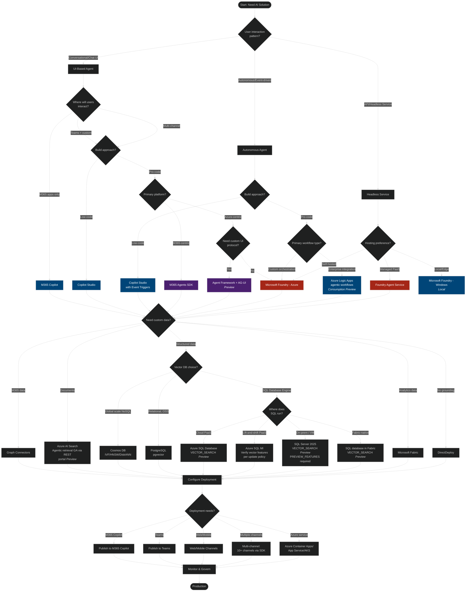
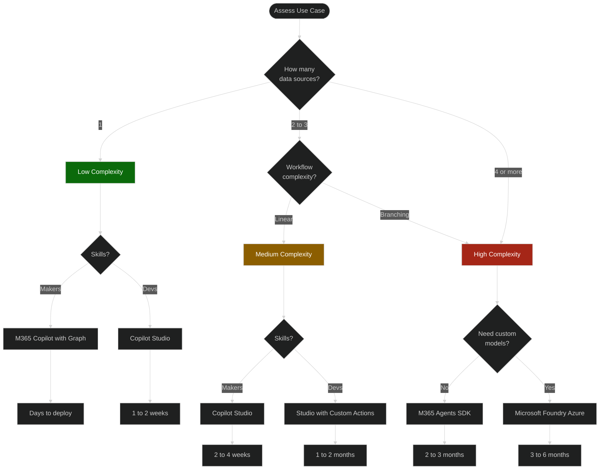
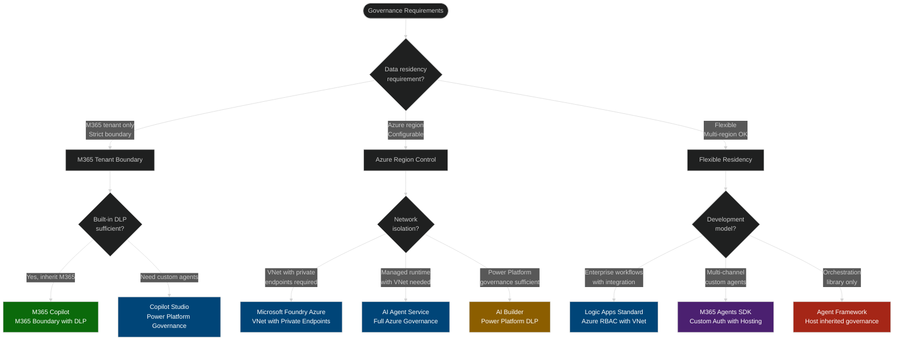
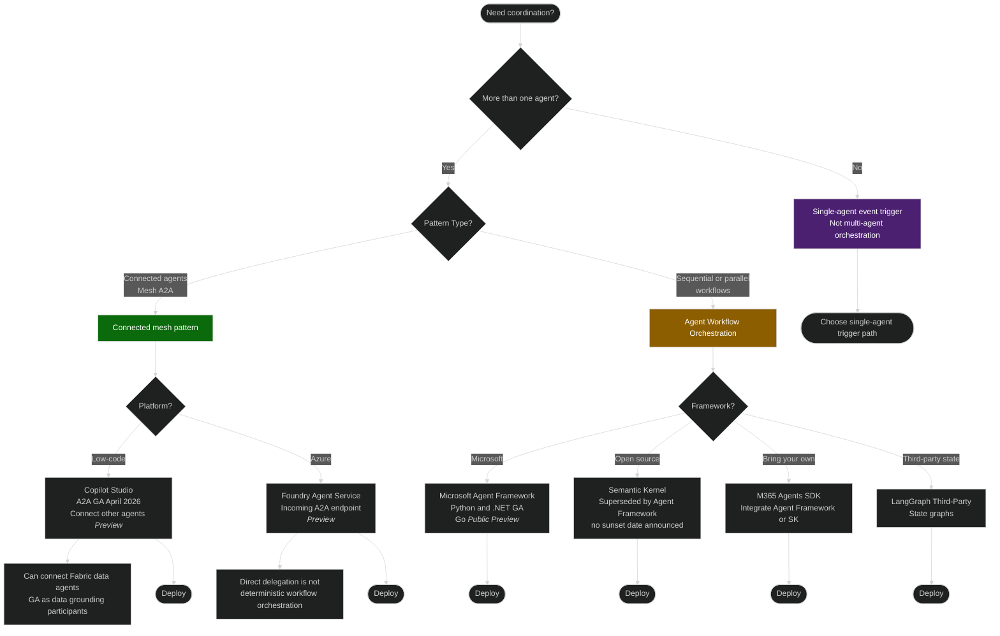
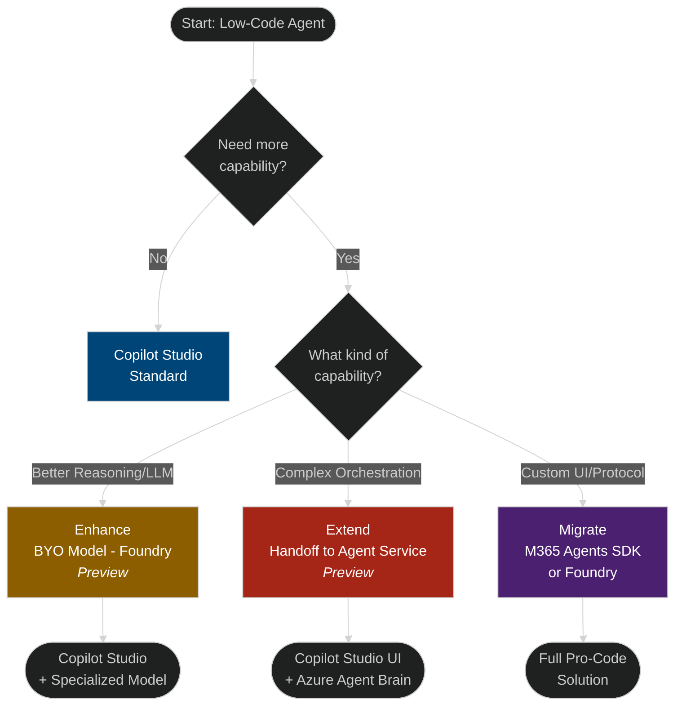
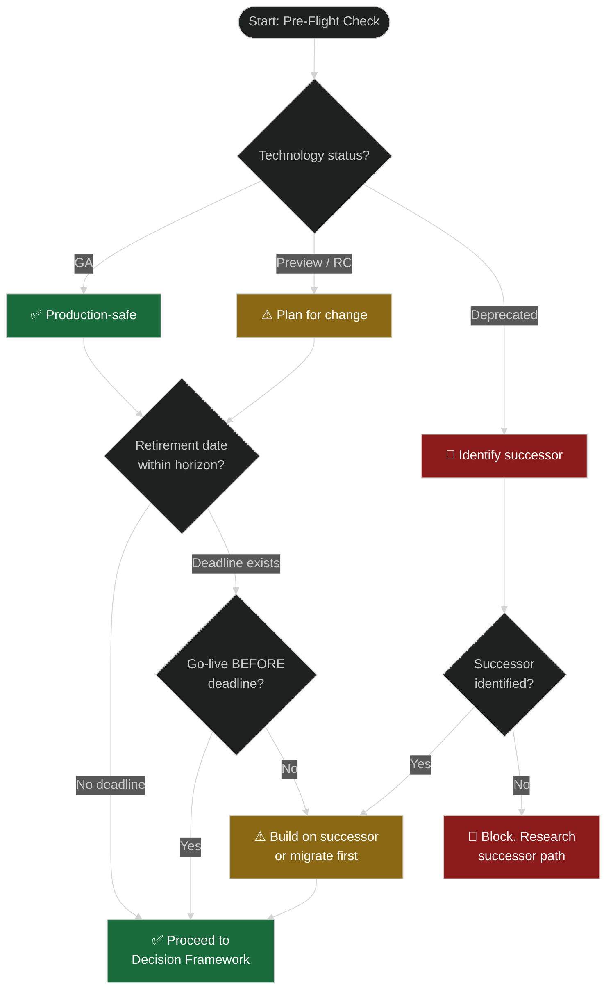
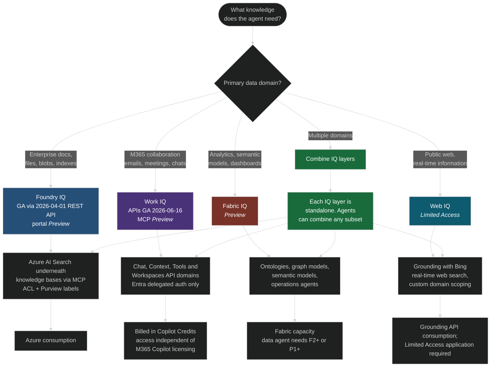

# Visual Framework
{: .no_toc }

Interactive decision trees to guide Microsoft AI technology selection.
{: .page-subtitle }

{: .note }
Use these diagrams after working through the [Decision Framework]({{ '/docs/decision-framework' | relative_url }}) and [Evaluation Criteria]({{ '/docs/evaluation-criteria' | relative_url }}). They reinforce the nine critical questions and are designed to support workshops, architecture reviews, and executive readouts.

## Table of contents
{: .no_toc .text-delta }

1. TOC
{:toc}

---

## Diagram Index

| Diagram | Purpose | Maps To Framework |
|---------|---------|-------------------|
| **1. Complete Decision Flow** | End-to-end technology selection | [Phase 2: Q1-Q9]({{ '/docs/decision-framework#phase-2-technology-groupings-question-0--nine-critical-questions' | relative_url }}) - All nine critical questions |
| **2. Data Grounding Decision** | Data strategy and knowledge sources | [Phase 2: Q3]({{ '/docs/decision-framework#question-3-data-grounding-pattern' | relative_url }}) - Data grounding patterns |
| **3. Persona-Based Flow** | Selection by role and skill level | [Phase 2: Q2]({{ '/docs/decision-framework#question-2-the-spectrum-of-control-build-style' | relative_url }}) - Build approach + [Scenarios]({{ '/docs/scenarios' | relative_url }}) |
| **4. Complexity Assessment** | Technical complexity evaluation | [Evaluation Criteria: Complexity]({{ '/docs/evaluation-criteria#complexity-assessment-architectural-load' | relative_url }}) |
| **5. Budget & Timeline** | Cost and time-to-production paths | [Evaluation Criteria: Budget & Time]({{ '/docs/evaluation-criteria#budget-assessment' | relative_url }}) |
| **6. Governance & Compliance** | Security and compliance requirements | [Evaluation Criteria: Governance]({{ '/docs/evaluation-criteria#governance--compliance-the-security-perimeter' | relative_url }}) |
| **7. Multi-Agent Orchestration** | Multi-agent patterns and frameworks | [Quick Reference: Orchestration Complexity]({{ '/docs/quick-reference#orchestration-complexity-decision-matrix' | relative_url }}) |
| **8. Upgrade Paths** | Migration and progressive enhancement | [Implementation Patterns: Progressive Enhancement]({{ '/docs/implementation-patterns#pattern-6-progressive-enhancement-low-code-to-pro-code-bridge' | relative_url }}) |
| **9. Lifecycle Check** | Pre-flight readiness gate | [Evaluation Criteria: Lifecycle & Operational Readiness]({{ '/docs/evaluation-criteria' | relative_url }}) |
| **10. IQ Layer Selection** | Knowledge grounding domain selection | [Microsoft AI Stack: Microsoft IQ]({{ '/docs/ai-stack' | relative_url }}) |

---

## Complete Decision Flow

{: .note }
> **Interactive version available.** Pan, zoom, and click nodes in the embedded explorer below, or [open the full explorer]({{ site.baseurl }}/explorer/?flow=complete-decision){:target="_blank"}.

  <iframe
    src="{{ site.baseurl }}/explorer/?flow=complete-decision&embed=true"
    style="width: 100%; height: 520px; border: none; background: #0d1117;"
    title="Complete Decision Flow - Interactive Explorer"
    loading="lazy"
  ></iframe>

View as static Mermaid diagram

### Validation Summary
{: .no_toc }

**Last Validated:** July 29, 2026

{: .warning }
> **Read the status column, not the product name.** Copilot Studio's **GitHub Copilot harness** is GA as of 2026-08-03, as are *generative orchestration* (within the standard harness), *computer use*, *A2A*, and *scheduled prompts*. Its **autonomous/triggered agents, child agents, connected agents, Foundry agents, and M365 Agents SDK agents are not documented as GA**, and **memory remains preview**. Treat every trigger-driven design as Preview until you confirm the specific feature. ([Copilot Studio what's new](https://learn.microsoft.com/en-us/microsoft-copilot-studio/whats-new))

#### UI-Based Agents (GA unless noted)
{: .no_toc }

| Technology | Action Safety | Proactive | Description |
|------------|---------------|-----------|-------------|
| **M365 Copilot** | 🔒 User-in-the-loop always | 🔄 Reactive only | Conversational chat in M365 apps [(docs)](https://learn.microsoft.com/en-us/microsoft-365/copilot/extensibility/) |
| **Copilot Studio** | ⚠️ Actions can execute (add approval workflows) | 🔄 Reactive (conversational) or **✅ Autonomous (event triggers)** | Low-code, 13+ channels [(docs)](https://learn.microsoft.com/en-us/microsoft-copilot-studio/fundamentals-what-is-copilot-studio) |
| **M365 Agents SDK** | ⚠️ Custom action safety design | ✅ Proactive capable | Pro-code, 10+ channels, C#/JS/Python, BYO orchestrator [(docs)](https://learn.microsoft.com/en-us/microsoft-365/copilot/extensibility/create-deploy-agents-sdk) |
| **Microsoft Foundry (Azure)** | ⚠️ Autonomous planning loops | ✅ Proactive capable | Custom UI deployment [(docs)](https://learn.microsoft.com/en-us/azure/foundry/what-is-foundry) |
| **Agent Framework + AG-UI** (Preview) | ⚠️ Approvals via AG-UI middleware | ✅ Proactive capable (inherits host orchestration) | Protocol bridges agents to web/mobile UI with SSE streaming, backend tool rendering, shared state, and CopilotKit components [(docs)](https://learn.microsoft.com/en-us/agent-framework/integrations/ag-ui/) |

#### Autonomous Agents
{: .no_toc }

| Technology | Action Safety | Proactive | Description |
|------------|---------------|-----------|-------------|
| **Copilot Studio** (event triggers) | ⚠️ Actions can execute | ⚠️ Triggered execution, **not documented as GA** | Event triggers: SharePoint, OneDrive, Planner, Recurrence. Scheduled prompts reached **GA 2026-07-01**; triggered/autonomous agents carry no GA statement [(docs)](https://learn.microsoft.com/en-us/microsoft-copilot-studio/authoring-triggers-about) |
| **Logic Apps agentic workflows** | ⚠️ Autonomous execution | ✅ Proactive (event-driven) | Official terms are **"agentic workflows"** and **"agent loop"**. **Consumption is explicitly in preview.** Standard carries no preview banner on the agent loop, but Microsoft never states Standard is GA and specific Standard capabilities are marked preview. Check the exact capability [(docs)](https://learn.microsoft.com/en-us/azure/logic-apps/agent-workflows-concepts) |
| **Microsoft Foundry (Azure) Agent Service** | ⚠️ Autonomous planning loops | ✅ Proactive capable | Custom orchestration [(docs)](https://learn.microsoft.com/en-us/azure/ai-foundry/agents/overview) |

#### API/Headless Services (GA)
{: .no_toc }

| Technology | Action Safety | Proactive | Description |
|------------|---------------|-----------|-------------|
| **Foundry Agent Service** | ⚠️ Autonomous planning loops | ✅ Proactive capable | REST API, managed PaaS [(docs)](https://learn.microsoft.com/en-us/azure/foundry/quickstarts/get-started-code) |
| **Microsoft Foundry (Azure)** | ⚠️ Autonomous planning loops | ✅ Proactive capable | REST API deployment [(docs)](https://learn.microsoft.com/en-us/rest/api/microsoft-foundry/) |

#### Vector Databases
{: .no_toc }

| Technology | Status | Capabilities |
|------------|--------|--------------|
| **Cosmos DB** | GA date not stated in docs | Flat/kNN, quantized flat, DiskANN index types; must be enabled as a feature. Ultra-high-throughput vector search is **Private Preview** [(docs)](https://learn.microsoft.com/en-us/azure/cosmos-db/nosql/vector-search) |
| **PostgreSQL pgvector** | GA | `azure_ai` extension also enables in-database embedding generation and LLM calls [(docs)](https://learn.microsoft.com/en-us/azure/postgresql/flexible-server/how-to-use-pgvector) |
| **Azure SQL Database** | `VECTOR_SEARCH()` **Preview** | Native `vector` type and `VECTOR_DISTANCE()` ship alongside it. Their status is documented separately, so verify before you assume. `TOP_N` is deprecated [(docs)](https://learn.microsoft.com/en-us/sql/t-sql/functions/vector-search-transact-sql) |
| **Azure SQL MI** | Not covered by the `VECTOR_SEARCH` preview note | Same SQL Database Engine; requires Always-up-to-date or SQL Server 2025 update policy. Verify vector feature availability for your update policy [(docs)](https://learn.microsoft.com/en-us/azure/azure-sql/managed-instance/update-policy) |
| **SQL Server 2025** | `VECTOR_SEARCH()` **Preview** | Additionally requires the `PREVIEW_FEATURES` database scoped configuration [(docs)](https://learn.microsoft.com/en-us/sql/t-sql/data-types/vector-data-type) |
| **SQL database in Fabric** | `VECTOR_SEARCH()` **Preview** | Fabric-native SQL, same engine capabilities [(docs)](https://learn.microsoft.com/en-us/fabric/database/sql/overview) |

#### Sources: Complete Decision Flow
{: .no_toc }

- [Logic Apps agentic workflows concepts](https://learn.microsoft.com/en-us/azure/logic-apps/agent-workflows-concepts) (verified 2026-07-29)
- [`VECTOR_SEARCH` T-SQL reference](https://learn.microsoft.com/en-us/sql/t-sql/functions/vector-search-transact-sql) (Preview on Azure SQL DB, SQL database in Fabric, SQL Server 2025)
- [Azure AI Search agentic retrieval](https://learn.microsoft.com/en-us/azure/search/agentic-retrieval-overview): GA via the **2026-04-01 REST API**; portal experiences remain preview-only
- [Copilot Studio what's new](https://learn.microsoft.com/en-us/microsoft-copilot-studio/whats-new) (verified 2026-07-29)

---

## Persona-Based Flow

{: .note }
> **Interactive version available.** Pan, zoom, and click nodes below, or [open the full explorer]({{ site.baseurl }}/explorer/?flow=persona){:target="_blank"}.

  <iframe
    src="{{ site.baseurl }}/explorer/?flow=persona&embed=true"
    style="width: 100%; height: 520px; border: none; background: #0d1117;"
    title="Persona-Based Flow - Interactive Explorer"
    loading="lazy"
  ></iframe>

View as static Mermaid diagram

```mermaid
%%{init: {'theme':'dark'}}%%
flowchart TD
    Start([Who are you?]) --> P1{Your role?}

    P1 -->|End user| User[Use M365 Copilot]
    P1 -->|Business maker| Maker{Dev support?}
    P1 -->|Developer| Dev{Focus area?}
    P1 -->|Data scientist/analyst| DS{Primary workload?}
    P1 -->|Integration specialist| IntSpec[Azure Logic Apps<br/>agentic workflows<br/><i>Consumption Preview</i>]

    Maker -->|No devs| MakerStudio[Copilot Studio]
    Maker -->|Occasional help| MakerPlus[Studio + Custom Actions]

    Dev -->|M365 integration| DevM365[M365 Agents SDK]
    Dev -->|Azure services| DevAzure[Microsoft Foundry - Azure]
    Dev -->|Multi-agent orchestration| DevOrch[Agent Framework]
    Dev -->|Multi-platform| DevChoice{Skill level?}
    Dev -->|Autonomous agents| DevAuto{Event-driven?}
    Dev -->|Custom UI streaming| DevAGUI[Agent Framework + AG-UI<br/><i>Preview</i>]
    Dev -->|My own codebase| DevLoop{Which rung of<br/>the developer loop?}

    DevLoop -->|Stay in the editor| DevIDE[GitHub Copilot agent mode<br/>in VS Code or Visual Studio]
    DevLoop -->|Delegate a whole issue| DevCloud[Copilot cloud agent<br/>GA on paid plans<br/>not on Copilot Free]
    DevLoop -->|Specialize the agent| DevCustom[Custom agents<br/>plus AGENTS.md<br/>agent instructions]
    DevLoop -->|Build on the harness| DevGHSDK[GitHub Copilot SDK<br/>GA - six languages<br/>Foundry hosting Python and C sharp only]

    DevChoice -->|Mid-level| DevStudio[Copilot Studio<br/>+ Custom Actions]
    DevChoice -->|Senior| DevSDK[M365 SDK or Foundry]

    DevAuto -->|Yes| DevLogic[Logic Apps<br/>agentic workflows<br/><i>Consumption Preview</i>]
    DevAuto -->|Custom orchestration| DevFoundry[Microsoft Foundry - Azure<br/>+ Agent Service]

    DS -->|Analytics/BI| DSFabric[Fabric data agents<br/>GA - needs F2+ or P1+]
    DS -->|ML/Custom models| DSFoundry[Microsoft Foundry - Azure]

    User --> UserEnd([Start using Copilot])
    MakerStudio --> MakerEnd([Build in Studio])
    MakerPlus --> MakerPlusEnd([Studio + code])
    DevM365 --> DevM365End([Build with SDK])
    DevAzure --> DevAzureEnd([Build in Foundry])
    DevOrch --> DevOrchEnd([Multi-agent workflows])
    DevStudio --> DevStudioEnd([Studio with code])
    DevSDK --> DevSDKEnd([Full code solution])
    DevLogic --> DevLogicEnd([Event-driven agent])
    DevFoundry --> DevFoundryEnd([Custom agent])
    DevAGUI --> DevAGUIEnd([Custom streaming UI])
    DevIDE --> DevIDEEnd([Inner loop assist])
    DevCloud --> DevCloudEnd([Issue in, pull request out])
    DevCustom --> DevCustomEnd([Repo-scoped specialists])
    DevGHSDK --> DevGHSDKEnd([Agent as a product])
    DSFabric --> DSFabricEnd([Data agent])
    DSFoundry --> DSFoundryEnd([ML pipeline])
    IntSpec --> IntSpecEnd([Enterprise workflows])

    style User fill:#0b6a0b,color:#fff
    style MakerStudio fill:#004578,color:#fff
    style MakerPlus fill:#004578,color:#fff
    style DevM365 fill:#4b2070,color:#fff
    style DevAzure fill:#4b2070,color:#fff
    style DevOrch fill:#4b2070,color:#fff
    style DevLogic fill:#004578,color:#fff
    style DevFoundry fill:#a52617,color:#fff
    style DevAGUI fill:#4b2070,color:#fff
    style DevIDE fill:#4b2070,color:#fff
    style DevCloud fill:#4b2070,color:#fff
    style DevCustom fill:#4b2070,color:#fff
    style DevGHSDK fill:#8c5e00,color:#fff
    style DSFabric fill:#8c5e00,color:#fff
    style DSFoundry fill:#a52617,color:#fff
    style IntSpec fill:#004578,color:#fff
```

### Validation Summary - Persona-Based Flow
{: .no_toc }

{: .note }
> **`P1` is a node id, not a taxonomy.** Microsoft does **not** use "1P/3P" as documented terminology. The documented ownership taxonomy is the **Agent Registry four types**: **Microsoft agents** ("built and maintained by Microsoft") · **External partner-built agents** ("built by trusted non-Microsoft developers") · **Published by your org** ("custom agents approved and published by your organization… might be referred to as LOB agents") · **Shared by creator** ("created and shared by individual users or developers at your organization"). Learn those four; map the slang once if you must. ([Agent Registry](https://learn.microsoft.com/en-us/microsoft-365/admin/manage/agent-registry))

**Last Validated:** July 29, 2026

#### End User (GA)
{: .no_toc }

| Technology | Description | Documentation |
|------------|-------------|---------------|
| **M365 Copilot** | Built-in AI in M365 apps, no setup required | [M365 Copilot](https://learn.microsoft.com/en-us/microsoft-365/copilot/extensibility/) |

#### Business Maker (GA)
{: .no_toc }

| Technology | Description | Documentation |
|------------|-------------|---------------|
| **Copilot Studio** | Low-code platform, no dev support needed | [Copilot Studio](https://learn.microsoft.com/en-us/microsoft-copilot-studio/fundamentals-what-is-copilot-studio) |
| **Copilot Studio + Custom Actions** | Low-code with occasional developer support for custom connectors/flows | [Add tools to custom agents](https://learn.microsoft.com/en-us/microsoft-copilot-studio/advanced-plugin-actions) |

#### Developer (GA unless noted)
{: .no_toc }

| Technology | Description | Documentation |
|------------|-------------|---------------|
| **M365 Agents SDK** | Pro-code for M365-centric solutions, C#/JavaScript/Python, 10+ channels, BYO orchestrator | [M365 Agents SDK](https://learn.microsoft.com/en-us/microsoft-365/copilot/extensibility/overview-custom-engine-agent) |
| **Microsoft Foundry (Azure)** | Pro-code for Azure-centric solutions, custom models, full control | [Microsoft Foundry](https://learn.microsoft.com/en-us/azure/ai-foundry/what-is-foundry) |
| **Microsoft Agent Framework** | **Microsoft's investment direction** - Microsoft describes it as the *"direct successor"* and *"next generation of both"* Semantic Kernel and AutoGen. Orchestration patterns: Sequential, Concurrent, Handoff, Group Chat, Magentic. Languages: Python, C#/.NET, and **Go (Public Preview)**. No sunset date has been announced for Semantic Kernel or AutoGen. | [Agent Framework](https://learn.microsoft.com/en-us/agent-framework/) |
| **Agent Framework + AG-UI** (Preview) | Protocol layer for web/mobile clients, supports SSE streaming, backend tool rendering, human approvals, shared/predictive state, and CopilotKit components. | [AG-UI Integration](https://learn.microsoft.com/en-us/agent-framework/integrations/ag-ui/) |
| **Copilot Studio + Custom Actions** | Mid-level developers, low-code with custom code extensibility | [Add tools to custom agents](https://learn.microsoft.com/en-us/microsoft-copilot-studio/advanced-plugin-actions) |
| **Logic Apps agentic workflows** | Event-driven agent loop, 1,400+ connectors. **Consumption is explicitly in preview.** Standard shows no preview banner on the agent loop, but Microsoft never states Standard is GA and some Standard capabilities are marked preview. | [Logic Apps agentic workflows](https://learn.microsoft.com/en-us/azure/logic-apps/agent-workflows-concepts) |

#### Developer: The Codebase Loop (Bucket 3)
{: .no_toc }

**The Trade-off: Speed of the inner loop vs. ownership of the harness.** The four rungs below are the developer-loop journey from the [Capability Model]({{ '/docs/capability-model' | relative_url }}). Each rung buys asynchrony and costs governance.

| Rung | Technology | Status and limits | Documentation |
|------|------------|-------------------|---------------|
| **1. Assist in the editor** | GitHub Copilot agent mode | GA in VS Code and Visual Studio | [Copilot agents in VS Code](https://code.visualstudio.com/docs/copilot/agents/overview) |
| **2. Delegate the issue** | **Copilot cloud agent** (renamed from "coding agent") | **GA on all paid plans including Student; NOT available on Copilot Free** | [About Copilot cloud agent](https://docs.github.com/en/copilot/concepts/agents/cloud-agent/about-cloud-agent) |
| **3. Specialize the agent** | **Custom agents** (`.md` + YAML frontmatter) and **`AGENTS.md`**, which GitHub calls **"agent instructions"** | Custom agents are **GA** for the cloud agent, VS Code, and Visual Studio; **Public Preview** for JetBrains, Eclipse, and Xcode. GitHub's own caveat on agent instructions: *"currently not supported by all Copilot features."* | [Custom agents](https://docs.github.com/en/copilot/concepts/agents/cloud-agent/about-custom-agents) |
| **4. Build on the harness** | **GitHub Copilot SDK** | **GA.** Python, TypeScript, Go, .NET, Java, Rust. Wraps the Copilot CLI engine over JSON-RPC. BYOK: OpenAI, Microsoft Foundry, Anthropic. | [Copilot SDK](https://github.com/github/copilot-sdk) |

{: .warning }
> **The seam has a hard edge.** Microsoft Foundry Agent Service explicitly lists the GitHub Copilot SDK as a supported framework for **Hosted agents**, but **Foundry Hosted agents support Python and C# only.** The SDK ships six language bindings; Foundry hosting accepts two. A Go, Rust, Java, or TypeScript Copilot SDK agent is **not directly hostable** as a Foundry Hosted agent. Pick the language at rung 4 with rung 5 already in mind.

#### Data Scientist/Analyst
{: .no_toc }

| Technology | Description | Documentation |
|------------|-------------|---------------|
| **Fabric data agents** | **GA** (formerly "AI skill"). Analytics/BI focus, Python SDK, evaluation capabilities, Power BI/semantic models. **Requires F2+ or P1+ capacity.** | [Fabric data agent](https://learn.microsoft.com/en-us/fabric/data-science/concept-data-agent) \| [Python SDK](https://learn.microsoft.com/en-us/fabric/data-science/evaluate-data-agent) |
| **Microsoft Foundry (Azure)** | ML/custom models, full AI/ML pipeline control | [Microsoft Foundry](https://learn.microsoft.com/en-us/azure/ai-foundry/what-is-foundry) |

#### Integration Specialist
{: .no_toc }

| Technology | Description | Documentation |
|------------|-------------|---------------|
| **Logic Apps agentic workflows** | Enterprise integration focus, 1,400+ connectors, workflow automation. **Consumption agentic workflows are explicitly in preview**; Standard has no preview banner on the agent loop, but Microsoft never states Standard is GA. Verify the exact capability you plan to use. | [Logic Apps Overview](https://learn.microsoft.com/en-us/azure/logic-apps/logic-apps-overview) \| [Agentic workflows](https://learn.microsoft.com/en-us/azure/logic-apps/agent-workflows-concepts) |

#### Sources: Persona-Based Flow
{: .no_toc }

- [About Copilot cloud agent](https://docs.github.com/en/copilot/concepts/agents/cloud-agent/about-cloud-agent) (rename verified 2026-07-29)
- [Microsoft Foundry Agent Service: Hosted agents](https://learn.microsoft.com/en-us/azure/foundry/agents/overview) (Python and C# only)
- [Fabric data agent](https://learn.microsoft.com/en-us/fabric/data-science/concept-data-agent) (GA; F2+ or P1+)
- [Logic Apps agentic workflows concepts](https://learn.microsoft.com/en-us/azure/logic-apps/agent-workflows-concepts) (verified 2026-07-29)

---

## Data Grounding Decision

{: .note }
> **Interactive version available.** Pan, zoom, and click nodes in the embedded explorer below, or [open the full explorer]({{ site.baseurl }}/explorer/?flow=data-grounding){:target="_blank"}.

  <iframe
    src="{{ site.baseurl }}/explorer/?flow=data-grounding&embed=true"
    style="width: 100%; height: 520px; border: none; background: #0d1117;"
    title="Data Grounding Decision - Interactive Explorer"
    loading="lazy"
  ></iframe>

View as static Mermaid diagram

```mermaid
%%{init: {'theme':'dark'}}%%
flowchart TD
    Start([Need to ground AI]) --> Q1{Where is<br/>your data?}

    Q1 -->|M365 only| M365Data{Data type?}
    Q1 -->|Azure only| AzureData{Data type?}
    Q1 -->|Both| Hybrid{Primary<br/>location?}
    Q1 -->|Analytics platform| FabricData[Microsoft Fabric]

    M365Data -->|SharePoint, OneDrive| Graph[Microsoft Graph Connectors]
    M365Data -->|Teams messages| GraphTeams[Graph Connectors]
    M365Data -->|Custom M365 app| GraphCustom[Custom Graph Connector]

    AzureData -->|Documents, PDFs| Q2{File count?}
    AzureData -->|Structured DB| DB{Database?}
    AzureData -->|Unstructured| Blob[Blob Storage with AI Search]

    Q2 -->|Under 10,000 files<br/>Simple setup| FileSearch{Platform?}
    Q2 -->|Production scale<br/>Custom chunking| Search[Azure AI Search]
    Q2 -->|Multimodal content| ContentUnderstanding[Azure AI Content Understanding<br/>with AI Search<br/>Preview]

    FileSearch -->|Azure Agent Service| AgentFileSearch[Agent Service File Search<br/>Auto chunk and embed]
    FileSearch -->|Copilot Studio| StudioKnowledge[Studio Knowledge Base<br/>Up to 1,000 files<br/>SharePoint or OneDrive]

    DB -->|Global scale, NoSQL| Cosmos{Vector algorithm?}
    DB -->|Relational, OSS| Postgres[PostgreSQL with pgvector]
    DB -->|SQL Database Engine| SQLFamily{Where does<br/>your SQL run?}

    SQLFamily -->|Cloud PaaS| AzureSQL[Azure SQL Database<br/>VECTOR_SEARCH Preview]
    SQLFamily -->|Lift-and-shift PaaS| SQLMI[Azure SQL MI<br/>Verify vector features<br/>per update policy]
    SQLFamily -->|On-prem / VM| SQL[SQL Server 2025<br/>VECTOR_SEARCH Preview<br/>PREVIEW_FEATURES required]
    SQLFamily -->|Fabric-native| SQLFabric[SQL database in Fabric<br/>VECTOR_SEARCH Preview]

    Cosmos -->|Flat index| CosmosIVF[Cosmos DB flat kNN]
    Cosmos -->|Quantized| CosmosHNSW[Cosmos DB quantized flat]
    Cosmos -->|Disk-optimized| CosmosDiskANN[Cosmos DB DiskANN]

    Hybrid -->|M365 primary| HybridM365[Graph with BYOK]
    Hybrid -->|Azure primary| HybridAzure[AI Search with Graph API]

    FabricData --> Q3{Access method?}
    Q3 -->|Direct platform access| FabricPlatform[Fabric Lakehouse and Warehouse<br/>OneLake with SQL endpoint]
    Q3 -->|Conversational agent| FabricAgent[Fabric data agents<br/>GA - needs F2+ or P1+]

    Graph --> Platform{Which<br/>platform?}
    GraphTeams --> Platform
    GraphCustom --> Platform
    AgentFileSearch --> Platform
    StudioKnowledge --> Platform
    Search --> Platform
    ContentUnderstanding --> Platform
    CosmosIVF --> Platform
    CosmosHNSW --> Platform
    CosmosDiskANN --> Platform
    Postgres --> Platform
    AzureSQL --> Platform
    SQLMI --> Platform
    SQL --> Platform
    SQLFabric --> Platform
    Blob --> Platform
    HybridM365 --> Platform
    HybridAzure --> Platform
    FabricPlatform --> Platform
    FabricAgent --> Platform

    Platform -->|M365 Copilot| PlatformM365([Use built-in])
    Platform -->|Copilot Studio| PlatformStudio([Configure Studio])
    Platform -->|M365 SDK| PlatformSDK([Code integration])
    Platform -->|Microsoft Foundry Azure| PlatformFoundry([Configure Foundry])
    Platform -->|Logic Apps| PlatformLogicApps([MCP Server<br/>Connector])

    style Graph fill:#004578,color:#fff
    style AgentFileSearch fill:#004578,color:#fff
    style StudioKnowledge fill:#4b2070,color:#fff
    style Search fill:#004578,color:#fff
    style ContentUnderstanding fill:#006192,color:#fff
    style CosmosIVF fill:#004578,color:#fff
    style CosmosHNSW fill:#004578,color:#fff
    style CosmosDiskANN fill:#004578,color:#fff
    style Postgres fill:#004578,color:#fff
    style AzureSQL fill:#004578,color:#fff
    style SQLMI fill:#004578,color:#fff
    style SQL fill:#004578,color:#fff
    style SQLFabric fill:#8c5e00,color:#fff
    style FabricPlatform fill:#8c5e00,color:#fff
    style FabricAgent fill:#8c5e00,color:#fff
```

### Validation Summary - Data Grounding Decision
{: .no_toc }

**Last Validated:** July 29, 2026

#### M365 Data Sources (GA)
{: .no_toc }

| Technology | Capabilities | Documentation |
|------------|--------------|---------------|
| **Microsoft Graph Connectors** | M365 data sources (SharePoint, OneDrive, Teams) | [Graph Connectors Overview](https://learn.microsoft.com/en-us/microsoftsearch/connectors-overview) |

#### Document Processing - File Search (GA)
{: .no_toc }

| Technology | Capabilities | Documentation |
|------------|--------------|---------------|
| **Foundry Agent Service File Search Tool** | Built-in file search with automatic parsing, chunking (800 tokens/400 overlap), embedding (text-embedding-3-large), keyword + semantic search, reranking. Supports up to 10,000 files per vector store (max 512 MB/file). Two modes: Basic (Microsoft-managed) vs Standard (BYO Azure AI Search + Blob Storage). Supported formats: .doc, .docx, .pdf, .pptx, .py, .md, .txt, .json, .html, .java, .cs, .cpp, and more. Service handles entire ingestion automatically. | [Agent Service File Search](https://learn.microsoft.com/en-us/azure/ai-foundry/agents/how-to/tools/file-search) |
| **Copilot Studio Knowledge Base** | File upload from local/OneDrive/SharePoint. Supports .doc, .docx, .ppt, .pptx, .pdf, .xls, .xlsx, .txt, .md, .html, .csv, .xml. Max 512 MB per file. Direct uploads allow up to 500 files per agent, while SharePoint/OneDrive document sources now support up to 1,000 files (GA Oct 6, 2025). Automatic chunking and vectorization into Dataverse with semantic indexing. OneDrive/SharePoint: Auto-sync (updates reflected automatically) vs Upload: Static files. SharePoint: User-scoped permissions (only files user has access to). | [Copilot Studio Knowledge](https://learn.microsoft.com/en-us/microsoft-copilot-studio/knowledge-unstructured-data) \| [File Upload](https://learn.microsoft.com/en-us/microsoft-copilot-studio/knowledge-add-file-upload) \| [SharePoint Files](https://learn.microsoft.com/en-us/microsoft-copilot-studio/knowledge-add-unstructured-data) \| [Use up to 1000 files](https://learn.microsoft.com/en-us/power-platform/release-plan/2025wave1/microsoft-copilot-studio/use-up-1000-files-per-agent-sharepoint-onedrive-uploads) |

#### Document Processing - Production Scale (GA)
{: .no_toc }

| Technology | Capabilities | Documentation |
|------------|--------------|---------------|
| **Azure AI Search** | Document indexing, full-text search, vector search, hybrid queries, custom chunking strategies (fixed-size, variable-size, Document Layout skill). Requires manual setup of indexers, skillsets, chunking strategy. Production-scale scenarios with millions of documents. | [AI Search Overview](https://learn.microsoft.com/en-us/azure/search/search-what-is-azure-search) \| [Chunking Strategies](https://learn.microsoft.com/en-us/azure/search/vector-search-how-to-chunk-documents) |

#### Document Processing - Multimodal (Preview)
{: .no_toc }

| Technology | Capabilities | Documentation |
|------------|--------------|---------------|
| **Azure AI Content Understanding** | Multimodal processing (documents/images/audio/video), RAG-ready Markdown output, AI Search custom skill integration, built-in chunking, standard/pro modes. API version: 2025-05-01-preview. | [Content Understanding Overview](https://learn.microsoft.com/en-us/azure/ai-services/content-understanding/overview) \| [Multimodal Search](https://learn.microsoft.com/en-us/azure/search/multimodal-search-overview) |

#### Structured Databases - Vector Search
{: .no_toc }

| Technology | Status | Capabilities | Documentation |
|------------|--------|--------------|---------------|
| **Cosmos DB Vector Search** | GA date is **not stated** in the docs. Treat the silence as silence | Three index types: flat/kNN, quantized flat, **DiskANN**. Must be enabled as a feature. Ultra-high-throughput vector search is **Private Preview** | [Cosmos DB Vector Search](https://learn.microsoft.com/en-us/azure/cosmos-db/vector-database) |
| **PostgreSQL pgvector** | **GA** | The `azure_ai` extension additionally enables in-database embedding generation and LLM calls. There is **no "PostgreSQL agent" product** | [PostgreSQL Vector Search](https://learn.microsoft.com/en-us/azure/postgresql/flexible-server/how-to-use-pgvector) |
| **Azure SQL Database** | `VECTOR_SEARCH()` **Preview** | Native `vector` type and `VECTOR_DISTANCE()` are documented separately. Do not assume they inherit the same status. `TOP_N` is deprecated | [VECTOR_SEARCH](https://learn.microsoft.com/en-us/sql/t-sql/functions/vector-search-transact-sql) |
| **Azure SQL Managed Instance** | Not named in the `VECTOR_SEARCH` preview note | Same SQL Database Engine; requires Always-up-to-date or SQL Server 2025 update policy. Verify feature availability for your policy | [SQL MI Update Policy](https://learn.microsoft.com/en-us/azure/azure-sql/managed-instance/update-policy) |
| **SQL Server 2025** | `VECTOR_SEARCH()` **Preview** | Additionally requires the `PREVIEW_FEATURES` database scoped configuration | [SQL Server Vector](https://learn.microsoft.com/en-us/sql/t-sql/data-types/vector-data-type) |
| **SQL database in Fabric** | `VECTOR_SEARCH()` **Preview** | Fabric-native SQL, same engine as Azure SQL Database | [SQL database in Fabric](https://learn.microsoft.com/en-us/fabric/database/sql/overview) |

#### Analytics Platform (GA with Preview features)
{: .no_toc }

| Technology | Status | Capabilities | Documentation |
|------------|--------|--------------|---------------|
| **Microsoft Fabric Platform** | GA | Direct knowledge source access via Lakehouse (Delta tables, Spark), Warehouse (T-SQL), OneLake (ADLS Gen2 APIs), KQL databases. Microsoft Foundry (Azure) integration for RAG | [Fabric Overview](https://learn.microsoft.com/en-us/fabric/fundamentals/microsoft-fabric-overview) \| [Microsoft Foundry (Azure) FAQ](https://learn.microsoft.com/en-us/azure/ai-foundry/faq) |
| **Fabric data agents** | **GA** | Formerly "AI skill". Analytics data grounding (warehouses, lakehouses, Power BI semantic models, KQL databases), consumable from Copilot Studio and Foundry Agent Service. **Requires F2+ or P1+ capacity** | [Fabric data agent](https://learn.microsoft.com/en-us/fabric/data-science/concept-data-agent) \| [Copilot Studio Integration](https://learn.microsoft.com/en-us/fabric/data-science/data-agent-microsoft-copilot-studio) |
| **Fabric IQ** | **Preview** | Documented Fabric workload for ontologies, graph models, semantic models, and operations agents, a different job from the data agent | [Fabric IQ](https://learn.microsoft.com/en-us/fabric/iq/) |
| **Foundry Tools in Fabric** | **Preview** | Billed to Fabric capacity units | [Fabric Overview](https://learn.microsoft.com/en-us/fabric/fundamentals/microsoft-fabric-overview) |

#### Sources: Data Grounding Decision
{: .no_toc }

- [Azure AI Search agentic retrieval](https://learn.microsoft.com/en-us/azure/search/agentic-retrieval-overview): **GA via the 2026-04-01 REST API; portal experiences remain preview-only.** The 2026-05-01-preview adds remote sources: MCP Server, Work IQ, Fabric data agent, Fabric ontology. Azure AI Search **was not renamed** in the Foundry rebrand
- [`VECTOR_SEARCH` T-SQL reference](https://learn.microsoft.com/en-us/sql/t-sql/functions/vector-search-transact-sql) (Preview)
- [Fabric data agent](https://learn.microsoft.com/en-us/fabric/data-science/concept-data-agent) (GA) and [Fabric IQ](https://learn.microsoft.com/en-us/fabric/iq/) (Preview), verified 2026-07-29

#### MCP Integration (Preview)
{: .no_toc }

| Technology | Capabilities | Documentation |
|------------|--------------|---------------|
| **Logic Apps MCP Server** | Standard logic apps as remote MCP servers, 1,400+ connectors, OAuth 2.0 auth, Streamable HTTP/SSE transports | [Logic Apps MCP Server](https://learn.microsoft.com/en-us/azure/logic-apps/set-up-model-context-protocol-server-standard) \| [API Center Integration](https://learn.microsoft.com/en-us/azure/logic-apps/create-mcp-server-api-center) |

#### When to Use File Search vs Azure AI Search
{: .no_toc }

| Solution | Use When | Cost |
|----------|----------|------|
| **File Search (Agent Service/Copilot Studio)** | Up to 10,000 files, simple setup (no manual indexer/chunking config), automatic embedding, suitable for smaller document sets, internal knowledge bases, rapid prototyping | Included in Agent Service consumption or Copilot Studio credits |
| **Azure AI Search** | Production scale (millions of documents), custom chunking strategies required, advanced features (analyzers, scoring profiles, faceting), complex indexing pipelines, enterprise search | Dedicated AI Search tier (Basic ~$75/mo to S3 ~$3K/mo) |

---

## Complexity Assessment Flow

{: .note }
> **Interactive version available.** Pan, zoom, and click nodes below, or [open the full explorer]({{ site.baseurl }}/explorer/?flow=complexity){:target="_blank"}.

  <iframe
    src="{{ site.baseurl }}/explorer/?flow=complexity&embed=true"
    style="width: 100%; height: 420px; border: none; background: #0d1117;"
    title="Complexity Assessment Flow - Interactive Explorer"
    loading="lazy"
  ></iframe>

View as static Mermaid diagram

---

## Budget & Timeline Tradeoffs

{: .note }
> **Interactive version available.** Pan, zoom, and click nodes below, or [open the full explorer]({{ site.baseurl }}/explorer/?flow=budget){:target="_blank"}.

  <iframe
    src="{{ site.baseurl }}/explorer/?flow=budget&embed=true"
    style="width: 100%; height: 520px; border: none; background: #0d1117;"
    title="Budget & Timeline Tradeoffs - Interactive Explorer"
    loading="lazy"
  ></iframe>

View as static Mermaid diagram

```mermaid
%%{init: {'theme':'dark'}}%%
flowchart TD
    Start([Project Constraints]) --> Q1{AI setup<br/>budget?}

    Q1 -->|Existing M365| M365Only[M365-Only Path]
    Q1 -->|USD 200 to 500 per month| Starter[Starter Budget]
    Q1 -->|USD 1K to 5K per month| Growth[Growth Budget]
    Q1 -->|USD 5K or more per month| Enterprise[Enterprise Budget]

    M365Only --> M365T{Timeline?}
    M365T -->|Days| M365_Fast[M365 Copilot Chat<br/>0 addl cost included with M365<br/>Instruction-based agents]
    M365T -->|1 to 2 Weeks| M365_Med[M365 Copilot with Graph<br/>0 addl cost<br/>Knowledge grounding]
M365T -->|1 Month or more| M365_Slow[Declarative Agents<br/>0 addl cost or PAYG<br/>Custom instructions and data]

    Starter --> StarterT{Timeline?}
    StarterT -->|1 to 2 Weeks| S_Fast[Copilot Studio PAYG<br/>USD 200 to 500 per month avg<br/>USD 0.01 per credit, low-code]
    StarterT -->|1 to 2 Months| S_Med[Studio with AI Builder<br/>USD 200 to 500 per month<br/>Document processing]
    StarterT -->|3 or more Months| S_Slow[Logic Apps agentic workflows<br/>Approx 200 to 400 per month<br/>Consumption Preview]

    Growth --> GrowthT{Timeline?}
    GrowthT -->|2 to 4 Weeks| G_Fast[Copilot Studio Capacity<br/>200 or more per month prepaid<br/>25K credits per pack]
    GrowthT -->|1 to 3 Months| G_Med[M365 SDK with Azure Basic<br/>USD 1 to 3K per month<br/>Custom agents, Azure hosting]
    GrowthT -->|3 to 6 Months| G_Slow[Microsoft Foundry Azure Starter<br/>USD 1 to 5K per month<br/>PAYG tokens with AI Search Basic]

    Enterprise --> EntT{Timeline?}
    EntT -->|4 to 8 Weeks| E_Fast[Foundry Serverless<br/>Approx 5 to 15K per month est<br/>PAYG with AI Search Standard]
    EntT -->|3 to 6 Months| E_Med[Foundry with Agent Service<br/>USD 10 to 30K per month est<br/>Managed orchestration]
    EntT -->|6 or more Months| E_Slow[Foundry PTU with Premium<br/>30K or more per month<br/>PTU reservation with S2 or S3 Search]

    style M365_Fast fill:#0b6a0b,color:#fff
    style M365_Med fill:#0b6a0b,color:#fff
    style S_Fast fill:#0b6a0b,color:#fff
    style G_Fast fill:#0b6a0b,color:#fff
    style G_Med fill:#0b6a0b,color:#fff
    style E_Med fill:#0b6a0b,color:#fff

    style M365_Slow fill:#8c5e00,color:#fff
    style S_Med fill:#8c5e00,color:#fff
    style G_Slow fill:#8c5e00,color:#fff
    style S_Slow fill:#9a4300,color:#fff
```

### Validation Summary - Budget & Timeline Tradeoffs
{: .no_toc }

**Last Validated:** July 29, 2026

#### M365-Only ($0 AI infrastructure add'l)
{: .no_toc }

| Solution | Monthly Cost | Documentation |
|----------|--------------|---------------|
| **M365 Copilot Chat** | Free (included) with eligible M365 subscription | Web-grounded chat and instruction-based agents [(docs)](https://learn.microsoft.com/en-us/microsoft-365/copilot/extensibility/cost-considerations#licensing-options-for-microsoft-365-copilot) |
| **M365 Copilot + Graph Connectors** | $30/user/month M365 Copilot license | Graph Connectors included at no extra charge [(docs)](https://learn.microsoft.com/en-us/microsoft-copilot-studio/billing-licensing#copilot-studio-use-rights-included-with-microsoft-365-copilot-license) |
| **Declarative Agents** | $0 or PAYG | Instruction-based or public-web grounded = $0; shared tenant data = PAYG [(docs)](https://learn.microsoft.com/en-us/microsoft-365/copilot/extensibility/cost-considerations#agents-in-copilot) |

#### Starter ($200-500/mo)
{: .no_toc }

| Solution | Monthly Cost | Documentation |
|----------|--------------|---------------|
| **Copilot Studio PAYG** | $200-500/mo (typical) | $0.01 per Copilot Credit [(docs)](https://learn.microsoft.com/en-us/microsoft-copilot-studio/billing-licensing#copilot-studio-pay-as-you-go) |
| **AI Builder** | Included in Power Platform | Document processing (invoices, receipts, contracts) [(docs)](https://learn.microsoft.com/en-us/ai-builder/overview) |
| **Logic Apps agentic workflows** | $200-400/mo (typical) | **Consumption agentic workflows are explicitly in preview.** Event-driven agent loop [(docs)](https://learn.microsoft.com/en-us/azure/logic-apps/agent-workflows-concepts) |

#### Growth ($1K-5K/mo)
{: .no_toc }

| Solution | Monthly Cost | Documentation |
|----------|--------------|---------------|
| **Copilot Studio Capacity Packs** | $200/month per 25,000 credits | Prepaid [(docs)](https://learn.microsoft.com/en-us/microsoft-copilot-studio/billing-licensing#copilot-studio-prepaid-copilot-credits-subscription) |
| **M365 SDK + Azure** | $600-2.3K/mo | SDK free; Azure hosting (App Service ~$100-300/mo) + Azure OpenAI PAYG (~$500-2K/mo tokens) [(docs)](https://learn.microsoft.com/en-us/microsoft-365/copilot/extensibility/cost-considerations#agents-in-copilot) |
| **Microsoft Foundry (Azure) Starter** | $1-5K/mo estimate | PAYG tokens + AI Search Basic (~$75/mo) [(OpenAI pricing)](https://azure.microsoft.com/en-us/pricing/details/azure-openai/) \| [(AI Search pricing)](https://learn.microsoft.com/en-us/azure/search/search-sku-tier#tier-descriptions) |

#### Enterprise ($5K+/mo)
{: .no_toc }

| Solution | Monthly Cost | Documentation |
|----------|--------------|---------------|
| **Foundry Serverless** | $5-15K/mo | PAYG tokens at scale + AI Search Standard S1 (~$250/mo) [(docs)](https://learn.microsoft.com/en-us/azure/search/search-sku-tier#tier-descriptions) |
| **Foundry + Agent Service** | $10-30K/mo | Managed orchestration PaaS + AI Search S2 (~$1K/mo) [(docs)](https://learn.microsoft.com/en-us/azure/ai-foundry/agents/overview) |
| **Foundry PTU + Premium** | $30K+/mo | PTU reservations (50+ PTUs minimum) + AI Search S2/S3 [(docs)](https://learn.microsoft.com/en-us/azure/ai-foundry/openai/how-to/provisioned-throughput-onboarding#hourly-usage) |

#### Timeline Estimates
{: .no_toc }

| Timeline | Use Case | Example Scenario |
|----------|----------|------------------|
| **Days** | M365 built-in features, no development | [(scenarios)](https://learn.microsoft.com/en-us/microsoft-365/copilot/extensibility/overview) |
| **1-2 Weeks** | Low-code platforms (Copilot Studio Employee Self-Service, Logic Apps) | [(HR Knowledge Base scenario)]({{ '/docs/scenarios' | relative_url }}) |
| **1-3 Months** | Custom agents with SDKs, moderate complexity | [(Customer Support scenario)]({{ '/docs/scenarios' | relative_url }}) |
| **3-6 Months** | Microsoft Foundry (Azure) custom solutions, complex orchestration | [(evaluation-criteria)]({{ '/docs/evaluation-criteria#time-to-production-the-runway' | relative_url }}) |
| **6+ Months** | Enterprise-scale with PTU, fine-tuning, advanced patterns | |

#### Cross-Tier: The Two Prepurchase Plans
{: .no_toc }

**The Trade-off: One invoice vs. two different currencies.** There is no single "unified" prepurchase. Microsoft ships **two distinct Azure Reservations**, and buying the wrong one is an expensive way to learn the difference.

One plan covers Copilot Credit usage only; the other spans Foundry, Copilot Studio, Fabric, and GitHub. Both are prepaid, both are non-refundable, and **the narrow one always burns first**. See [Microsoft AI Stack]({{ '/docs/ai-stack' | relative_url }}) for why that ordering decides what a broad commitment is actually worth.

| | **Copilot Credit Pre-Purchase Plan** | **Microsoft Agent Prepurchase Plan** |
|---|---|---|
| Unit | **CCCU** (Copilot Credit CUs) | **ACU** (Agent CUs) |
| Covers | "eligible Copilot Credit usage" | "select services across **Microsoft Foundry, Microsoft Copilot Studio, Microsoft Fabric, and GitHub** costs", where the Copilot Studio entry also spans Dynamics 365 first-party agents and Copilot |
| Value | 1 CCCU pays down US$1 of qualifying retail cost, purchased at a tiered discount (~5 to 6% in Microsoft's worked examples) | 1 ACU pays down US$1 of qualifying retail cost, purchased at a tiered discount (~5 to 6% in Microsoft's worked examples) |
| Docs | [Copilot Credit Pre-Purchase Plan](https://learn.microsoft.com/en-us/azure/cost-management-billing/reservations/copilot-credit-p3) | [Microsoft Agent Prepurchase Plan](https://learn.microsoft.com/en-us/azure/cost-management-billing/reservations/agent-pre-purchase) |

Both are 1-year terms with auto-renew **on** by default, and **all purchases are final**: no cancel, exchange, split, or merge.

**Precedence: narrow benefits burn before broad benefits.** Microsoft states it plainly: *"Reservations always apply before prepurchase plans."* The order is:

1. Microsoft Foundry **PTU Reservations**
2. Microsoft **Fabric Capacity Reservations**
3. **Copilot Credit Prepurchase Plan**
4. **Microsoft Agent Prepurchase Plan**: *"Applied last to remaining AI usage across all platforms."*

{: .warning }
> **Do not assume coverage.** Whether Copilot Cowork and Work IQ consumption draws down these plans is **inferred, not stated** in Microsoft's documentation. Confirm with your account team before you model it into a business case.

See [Evaluation Criteria: Budget]({{ '/docs/evaluation-criteria#budget-assessment' | relative_url }}).

#### Cost Calculation Notes
{: .no_toc }

- M365 per-user costs ($30/user/month) NOT included in bands - these are AI infrastructure costs only
- Estimates assume moderate usage (not high-scale production)
- Azure consumption highly variable based on tokens, requests, storage
- PTU (Provisioned Throughput Units) require Azure Reservations for cost optimization

#### Sources
{: .no_toc }

- [Copilot Studio Licensing](https://learn.microsoft.com/en-us/microsoft-copilot-studio/billing-licensing) (Updated: 2025-11-05)
- [M365 Copilot Cost Considerations](https://learn.microsoft.com/en-us/microsoft-365/copilot/extensibility/cost-considerations) (Updated: 2025-11-25)
- [Azure OpenAI Pricing](https://azure.microsoft.com/en-us/pricing/details/azure-openai/) (Updated: 2026)
- [Azure AI Search Tiers](https://learn.microsoft.com/en-us/azure/search/search-sku-tier) (Updated: 2025-11-06)
- [Logic Apps agentic workflows](https://learn.microsoft.com/en-us/azure/logic-apps/agent-workflows-concepts) (Consumption Preview, verified 2026-07-29)
- [Microsoft Agent Prepurchase Plan](https://learn.microsoft.com/en-us/azure/cost-management-billing/reservations/agent-pre-purchase) and [Copilot Credit Pre-Purchase Plan](https://learn.microsoft.com/en-us/azure/cost-management-billing/reservations/copilot-credit-p3) (both ms.date 2026-07-17)
- [AI Builder Overview](https://learn.microsoft.com/en-us/ai-builder/overview) (Updated: 2026-01-14)

---

## Governance & Compliance Path

{: .note }
> **Interactive version available.** Pan, zoom, and click nodes below, or [open the full explorer]({{ site.baseurl }}/explorer/?flow=governance){:target="_blank"}.

  <iframe
    src="{{ site.baseurl }}/explorer/?flow=governance&embed=true"
    style="width: 100%; height: 420px; border: none; background: #0d1117;"
    title="Governance & Compliance Path - Interactive Explorer"
    loading="lazy"
  ></iframe>

View as static Mermaid diagram

### Validation Summary: Governance & Compliance Path
{: .no_toc }

**Last Validated:** July 29, 2026

#### M365 Tenant Boundary Technologies
{: .no_toc }

| Technology | Action Safety | Proactive | Data Grounding/Memory/Analytics | Key Governance Features | Documentation |
|------------|---------------|-----------|----------------------------------|------------------------|---------------|
| **M365 Copilot** (GA) | ✅ User-in-the-loop (drafts only) | ❌ Reactive only | Grounding only (M365 Graph per-request), no extractable memory | M365 trust boundary, auto DLP/sensitivity labels, user-scoped permissions, Purview audit, no training on tenant data | [M365 Copilot Security](https://learn.microsoft.com/en-us/microsoft-365/copilot/security-microsoft-365-copilot) |
| **Copilot Studio** (GA) | ⚠️ Actions execute (flows/connectors) | ✅ Autonomous (event triggers) | Grounding + Dataverse persistence (transcripts, variables), full analytics | Power Platform RBAC + DLP, environment-level governance, connector controls, ⚠️ web search leaves boundary, ⚠️ dual auth (user/service) | [Copilot Studio Security](https://learn.microsoft.com/en-us/microsoft-copilot-studio/security-and-governance) |

#### Azure Region Control Technologies
{: .no_toc }

| Technology | Action Safety | Proactive | Data Grounding/Memory/Analytics | Key Governance Features | Documentation |
|------------|---------------|-----------|----------------------------------|------------------------|---------------|
| **Microsoft Foundry (Azure)** (GA) | ⚠️ Tool calling with autonomous planning | ✅ Proactive (Azure Functions, Logic Apps) | Grounding + BYO thread storage (Cosmos DB), Azure Monitor + OpenTelemetry | Azure RBAC (control + data plane), VNet + private endpoints, managed identity, CMK optional, ⚠️ API key OR Entra ID (Entra recommended) | [Microsoft Foundry security](https://learn.microsoft.com/en-us/azure/foundry/concepts/rbac-foundry) |
| **AI Agent Service** | ⚠️ Autonomous with action tools (Logic Apps, Functions, MCP) | ✅ Proactive (event triggers) | BYO thread storage (Cosmos DB), Azure Monitor project-scoped | Full RBAC (project + resource), VNet + private endpoints, BYO storage, no public egress by default, container injection for VNet | [Agent Service Security](https://learn.microsoft.com/en-us/azure/ai-foundry/responsible-ai/agents/data-privacy-security) |
| **AI Builder** (GA) | Varies by model type | ❌ Reactive | Dataverse storage | Power Platform DLP, Dataverse RBAC, environment location | [AI Builder Governance](https://learn.microsoft.com/en-us/ai-builder/administer) |

#### Flexible Residency Technologies
{: .no_toc }

| Technology | Action Safety | Proactive | Data Grounding/Memory/Analytics | Key Governance Features | Documentation |
|------------|---------------|-----------|----------------------------------|------------------------|---------------|
| **Logic Apps Standard** (workflow platform) | ⚠️ Autonomous execution (workflows) | ✅ Proactive (event-driven, 1,400+ connectors) | Workflow state + connector data | Granular Azure RBAC, VNet + private endpoints (Standard), managed identity, Customer Lockbox, FedRAMP/HIPAA/ISO 27001 | [Logic Apps Security](https://learn.microsoft.com/en-us/azure/logic-apps/security-controls-policy) |
| **M365 Agents SDK** (GA) | ⚠️ Custom design (full developer responsibility) | ✅ Proactive (custom event handling) | Custom (developer implements) | Custom auth (MSAL, Entra ID), hosting platform RBAC, ⚠️ delegated OR application permissions, self-hosted = full network control | [M365 SDK Auth](https://learn.microsoft.com/en-us/microsoft-365/agents-sdk/microsoft-authentication-library-configuration-options) |
| **Agent Framework** (GA) | Inherits from host app | Inherits from host app | Inherits from host app | No built-in governance (library only), inherits from hosting platform | [Agent Framework](https://learn.microsoft.com/en-us/agent-framework/) |

**Key Decision Criteria:**
- **M365 tenant boundary required** → M365 Copilot (strict) or Copilot Studio (custom agents)
- **Azure region control + VNet isolation** → Microsoft Foundry (Azure) or Foundry Agent Service
- **Enterprise workflow automation** → Logic Apps Standard
- **Custom multi-channel agents** → M365 Agents SDK (full control, full responsibility)
- **Orchestration library only** → Agent Framework (no built-in governance)

{: .warning }
> **The Logic Apps status trap.** The rows above describe the **workflow platform**, not the agent loop. Microsoft explicitly marks **Consumption agentic workflows** as preview. **Standard** carries no preview banner on the agent loop itself, but Microsoft never states Standard is GA, and specific Standard capabilities are marked preview. Absence of a banner is silence, not a guarantee. Check the exact capability you plan to ship. ([Agentic workflows concepts](https://learn.microsoft.com/en-us/azure/logic-apps/agent-workflows-concepts), verified 2026-07-29)

{: .note }
> **Identity for agents has a product name now.** **Microsoft Entra Agent ID** is a formally named product within Microsoft Entra that provides the platform for creating and managing agent identities and agent identity blueprints, and Microsoft states it is **now generally available**. **Microsoft Agent 365** reached **GA on 2026-05-01**, is licensed per user, and is included in **Microsoft 365 E7**; its Shadow AI component remains preview. ([Entra Agent ID](https://learn.microsoft.com/en-us/entra/agent-id/what-is-microsoft-entra-agent-id) \| [Agent 365 overview](https://learn.microsoft.com/en-us/microsoft-agent-365/overview))

---

## Multi-Agent Orchestration

{: .note }
> **Interactive version available.** Pan, zoom, and click nodes below, or [open the full explorer]({{ site.baseurl }}/explorer/?flow=multi-agent){:target="_blank"}.

  <iframe
    src="{{ site.baseurl }}/explorer/?flow=multi-agent&embed=true"
    style="width: 100%; height: 520px; border: none; background: #0d1117;"
    title="Multi-Agent Orchestration - Interactive Explorer"
    loading="lazy"
  ></iframe>

View as static Mermaid diagram

### Validation Summary: Multi-Agent Orchestration
{: .no_toc }

**Last Validated:** July 29, 2026

#### Connected Agents / Sub-Agent Pattern
{: .no_toc }

| Technology | Status | Capabilities | Documentation |
|------------|--------|--------------|---------------|
| **Copilot Studio** | **A2A GA (April 2026)**; **"Connect other agents" is Preview** | Agent-to-agent mesh, connected agents, and what Microsoft's guidance calls *"inline agents, also known as child agents."* Do not read A2A's GA as a blanket GA for the multi-agent surface | [Connected Agents](https://learn.microsoft.com/en-us/microsoft-copilot-studio/authoring-add-other-agents) |
| **Foundry Agent Service** | Preview (incoming A2A endpoint) | Lightweight direct delegation; direction and protocol support must be validated | [A2A integration](https://learn.microsoft.com/en-us/agent-framework/integrations/a2a) |
| **Fabric data agents** | **GA** | Consumed by other agents for data grounding (NOT an orchestrator). Requires F2+ or P1+ capacity | [Fabric integration](https://learn.microsoft.com/en-us/fabric/data-science/data-agent-microsoft-copilot-studio) |

#### Agent Workflow Orchestration
{: .no_toc }

**Foundry Workflows is retiring.** Microsoft's wording, quoted exactly:

> *"Microsoft Foundry is retiring workflows on December 1, 2026. If you're looking to build new workflows, use Microsoft Agent Framework. To migrate existing workflows, see the Migration guide section of this article for all supported paths."*

Three documented migration paths, each with a different center of gravity:

- **Microsoft Agent Framework**: the recommended path; exported YAML is reusable with minimal changes.
- **Azure Logic Apps**: keeps a visual designer, aimed at business-process automation.
- **Agent-to-agent (A2A)**: lightweight handoffs.

Exported YAML definitions **remain executable when deployed as Hosted Agents**. After 2026-12-01, the visual designer and in-portal execution are unsupported.

| Technology | Status | Orchestration Patterns | Documentation |
|------------|--------|------------------------|---------------|
| **Microsoft Agent Framework** | GA (Python, C#/.NET); **Go is Public Preview** | Microsoft's stated *"direct successor"* to Semantic Kernel and AutoGen: Sequential, Concurrent, Handoff, Group Chat, Magentic | [Agent Framework](https://learn.microsoft.com/en-us/agent-framework/) |
| **Semantic Kernel** | Superseded by Agent Framework; **no sunset date announced** | Sequential, Concurrent, Group Chat, Handoff, Magentic. Migration guides exist for both SK and AutoGen | [Semantic Kernel Agents](https://learn.microsoft.com/semantic-kernel/frameworks/agent/) |
| **M365 Agents SDK** | GA | BYO orchestrator (integrate Agent Framework or third-party) | [M365 SDK](https://learn.microsoft.com/en-us/microsoft-365/copilot/extensibility/create-deploy-agents-sdk) |
| **LangGraph** | Third-party | State graph management for complex workflows | Third-party framework |

#### Event-Driven Agents (Single Agent Triggering)
{: .no_toc }

| Technology | Status | Event Handling | Documentation |
|------------|--------|----------------|---------------|
| **Logic Apps agentic workflows** | **Consumption explicitly Preview**; Standard has no preview banner on the agent loop, but Microsoft never states Standard is GA | Event triggers + MCP Server (triggers a SINGLE agent, NOT multi-agent orchestration) | [Agentic workflows](https://learn.microsoft.com/en-us/azure/logic-apps/agent-workflows-concepts) |
| **Azure Functions + Agent Service** | GA | Event-driven single agent invocation (event routing, NOT coordination) | [Agent Service](https://learn.microsoft.com/azure/ai-foundry/responsible-ai/agents/transparency-note) |
| **Event Grid + Foundry** | GA | Event routing to trigger agents independently (NOT orchestration) | [Azure Event Grid](https://learn.microsoft.com/azure/event-grid/) |

#### Sources: Multi-Agent Orchestration
{: .no_toc }

- [Foundry Workflows retirement and migration guide](https://learn.microsoft.com/en-us/azure/foundry/agents/concepts/workflow) (retirement date 2026-12-01)
- [Microsoft Agent Framework](https://learn.microsoft.com/en-us/agent-framework/) (Python, C#/.NET; Go Public Preview)
- [Copilot Studio what's new](https://learn.microsoft.com/en-us/microsoft-copilot-studio/whats-new): A2A GA April 2026; "Connect other agents (Preview)" still listed (verified 2026-07-29)

**Key Distinctions:**
- **Connected/Mesh:** Agents discover and invoke each other (A2A) or delegate to inline/child agents
- **Workflow Orchestration:** Sequential/parallel/concurrent agent coordination patterns
- **Event-Driven:** Single agent triggered by events (NOT multi-agent orchestration)

---

## Upgrade Paths

{: .note }
> **Interactive version available.** Pan, zoom, and click nodes below, or [open the full explorer]({{ site.baseurl }}/explorer/?flow=upgrade){:target="_blank"}.

  <iframe
    src="{{ site.baseurl }}/explorer/?flow=upgrade&embed=true"
    style="width: 100%; height: 420px; border: none; background: #0d1117;"
    title="Upgrade Paths - Interactive Explorer"
    loading="lazy"
  ></iframe>

View as static Mermaid diagram

### Validation Summary: Upgrade Paths
{: .no_toc }

**Last Validated:** July 29, 2026

#### Progressive Enhancement Mechanisms
{: .no_toc }

| Mechanism | Status | Description | Documentation |
|-----------|--------|-------------|---------------|
| **BYO Model** | Preview | Swap the default Copilot Studio model for a specialized model from the Microsoft Foundry catalog, which lists **over 10,000 models** | [BYO Model](https://learn.microsoft.com/en-us/microsoft-copilot-studio/advanced-generative-actions) |
| **Agent Handoff** | Preview | Copilot Studio delegates to a Foundry agent for complex tasks. Foundry agents are **not** documented as GA in Copilot Studio | [Connect to a Foundry agent](https://learn.microsoft.com/en-us/microsoft-copilot-studio/add-agent-foundry-agent) |
| **Shared Knowledge** | GA | Both Copilot Studio and custom apps can consume the same Azure AI Search index. **Azure AI Search was not renamed** in the Foundry rebrand | [Azure AI Search](https://learn.microsoft.com/azure/search/) |

---

## Using This Guide
{: .no_toc }

**How to navigate:** Start with Complete Decision Flow for end-to-end guidance, or jump to specific sections: Persona-Based Flow (by role), Data Grounding (data architecture), Complexity Assessment (effort estimate), Budget & Timeline (cost/time), Governance Path (compliance), or Multi-Agent (orchestration).

**Diagram conventions:** Diamonds = decisions, Rectangles = technologies, Circles = start/end. **Colors:** Blue = Microsoft core, Purple = developer tools, Green = low complexity, Orange = medium complexity, Red = high complexity/enterprise.

---

## Lifecycle Check

{: .note }
> **Interactive version available.** Pan, zoom, and click nodes below, or [open the full explorer]({{ site.baseurl }}/explorer/?flow=lifecycle){:target="_blank"}.

  <iframe
    src="{{ site.baseurl }}/explorer/?flow=lifecycle&embed=true"
    style="width: 100%; height: 420px; border: none; background: #0d1117;"
    title="Lifecycle Check - Interactive Explorer"
    loading="lazy"
  ></iframe>

View as static Mermaid diagram

**Active Deadlines (as of July 29, 2026):**
- **Foundry Workflows → retires December 1, 2026.** Verbatim: *"Microsoft Foundry is retiring workflows on December 1, 2026. If you're looking to build new workflows, use Microsoft Agent Framework."* Paths: Microsoft Agent Framework (recommended) · Azure Logic Apps (visual designer) · A2A (lightweight handoffs)
- **Copilot Studio for Teams app → after end of June 2026**, verbatim: *"it will no longer be possible to use the Copilot Studio for Teams app to create classic chatbots. The app will redirect you to the Copilot Studio web app instead."* Scope: **makers on a Teams plan**, who are *"limited to creating agents that use classic orchestration… and they can only publish these agents to Microsoft Teams."* Standalone Copilot Studio subscriptions are unaffected
- **Azure Cache for Redis Enterprise + Enterprise Flash → retire 2027-03-31** (disabled 2027-04-01); Basic/Standard/Premium retire 2028-09-30 (disabled 2028-10-01)
- `azure-ai-inference` SDK → retires **May 30, 2026** (successor: `openai` SDK)
- Bot Framework → retired **Dec 31, 2025** (successor: M365 Agents SDK)
- Assistants API → a sunset is documented, but ⚠️ **the exact date is unconfirmed against current Foundry documentation.** Plan the migration to the Responses API and Foundry Agents Service; verify the date yourself before you build a program plan around it

---

## IQ Layer Selection

{: .note }
> **Interactive version available.** Pan, zoom, and click nodes below, or [open the full explorer]({{ site.baseurl }}/explorer/?flow=iq-layer){:target="_blank"}.

  <iframe
    src="{{ site.baseurl }}/explorer/?flow=iq-layer&embed=true"
    style="width: 100%; height: 420px; border: none; background: #0d1117;"
    title="IQ Layer Selection - Interactive Explorer"
    loading="lazy"
  ></iframe>

View as static Mermaid diagram

**Key distinction:** These four Microsoft IQ capabilities are *not* interchangeable. Each grounds agents in a different data domain: enterprise documents (Foundry IQ), collaboration signals (Work IQ), analytics and business logic (Fabric IQ), or live web information (Web IQ). Choose based on data domain, not brand preference.

### Validation Summary: IQ Layer Selection
{: .no_toc }

**Last Validated:** July 29, 2026

| Layer | Status: read the qualifier, not the brand | What it actually is |
|-------|-------------------------------------------|---------------------|
| **Foundry IQ** | Agentic retrieval is **GA via the 2026-04-01 REST API; portal experiences remain preview-only** | Knowledge bases over **Azure AI Search**, which **was not renamed** in the Foundry rebrand. The 2026-05-01-preview API adds remote sources: MCP Server, Work IQ, Fabric data agent, Fabric ontology |
| **Work IQ** | **APIs GA 2026-06-16.** ⚠️ **Work IQ MCP is Preview** | Four API domains: Chat, Context, Tools, Workspaces. Billed in **Copilot Credits**. **Entra delegated auth only; app-only is NOT supported.** Workspaces use SharePoint Embedded storage. Access is **independent of M365 Copilot licensing** |
| **Fabric IQ** | **Preview** workload | Ontologies, graph models, semantic models, and operations agents. Distinct from the **Fabric data agent**, which is **GA** and requires F2+ or P1+ capacity |
| **Web IQ** | Limited Access, requires a separate application | Grounding with Bing, real-time web search, custom domain scoping |

#### Sources: IQ Layer Selection
{: .no_toc }

- [Azure AI Search agentic retrieval](https://learn.microsoft.com/en-us/azure/search/agentic-retrieval-overview) (GA via 2026-04-01 REST API; portal preview-only)
- [Work IQ APIs announcement](https://www.microsoft.com/en-us/microsoft-365/blog/2026/06/02/announcing-the-new-work-iq-apis/) (APIs GA 2026-06-16) and [Work IQ MCP overview (preview)](https://learn.microsoft.com/en-us/microsoft-agent-365/tooling-servers-overview)
- [Fabric IQ](https://learn.microsoft.com/en-us/fabric/iq/) (Preview) and [Fabric data agent](https://learn.microsoft.com/en-us/fabric/data-science/concept-data-agent) (GA)

---

**Last Updated:** July 29, 2026
**Next:** [Evaluation Criteria]({{ '/docs/evaluation-criteria' | relative_url }}) - Score complexity, skills, budget, and governance after selecting a path

---
## Next Steps
{: .no_toc }

**Detailed comparisons:**
→ [Feature Comparison]({{ '/docs/feature-comparison' | relative_url }})

**Real-world examples:**
→ [Scenarios]({{ '/docs/scenarios' | relative_url }})

**Evaluate readiness:**
→ [Evaluation Criteria]({{ '/docs/evaluation-criteria' | relative_url }})

---

